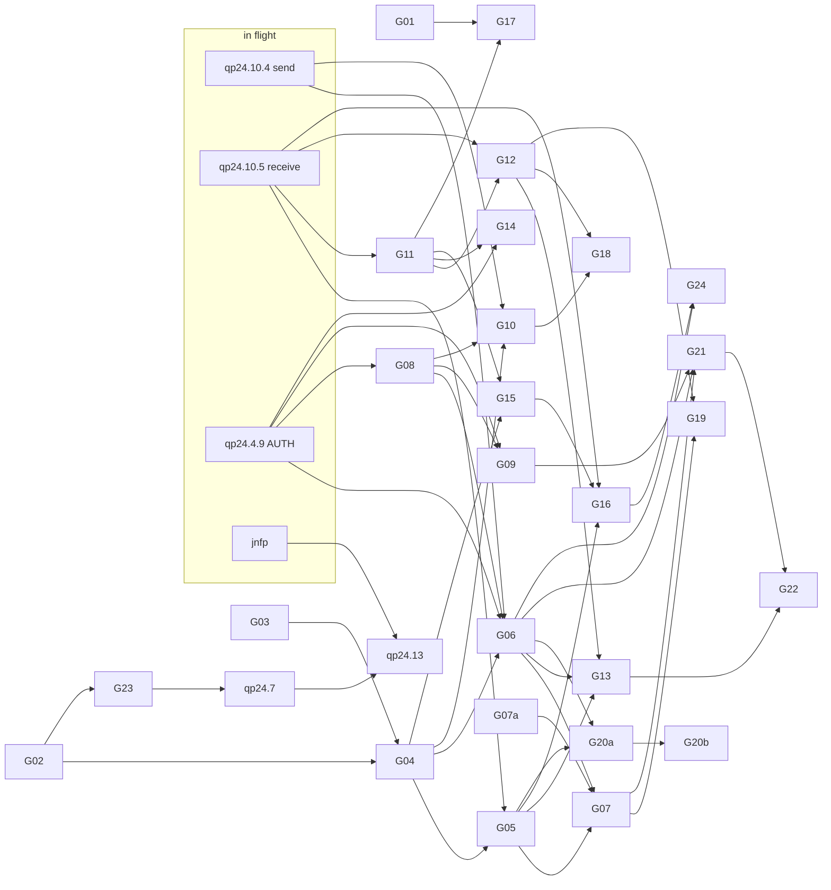

# Groundhog privacy and modern-UX charter

**Date:** 2026-09-28 · **Bead:** `nostrc-qp24.17` (design only; no code or bead changes) · **Target:** `gnome/groundhog/` at `2854b18a`

**Relationship to the plan.** `docs/plans/groundhog-gnome-messaging-2026-09-25.md` stays authoritative for protocol flows (NIP-17 wrap/seal rules, NIP-29 authority, Marmot lifecycle) and release gates. This charter is authoritative for:

- privacy defaults;
- the threat model;
- the encrypted local store and outbox;
- network and AUTH exposure;
- notification privacy and background delivery;
- attachment policy;
- the Blueprint information architecture.

Where this charter tightens the plan, the tightening is called out and the plan should link here.

**Product goal.** Groundhog is the most modern and privacy-minded messenger on GNOME: calm and approachable for non-technical people, honest about what the protocols can and cannot hide, and verifiable. Every default in this charter has a named automated test; a default without a test is not a default.

---

## 0. Summary

### 0.1 Key decisions

1. **No read receipts, typing indicators, presence or "delivered/read" states. Ever.** Status never claims more than a relay-local `OK`. The strongest outgoing state is "Sent", defined as "accepted by at least one of each recipient's inbox relays", with details on demand.
2. **Nothing is fetched from the web by default.** This covers link previews, remote images, profile pictures, NIP-05 lookups and attachment downloads. Each is an explicit, per-item action that goes through the configured network mode.
3. **Strict relay minimization is a tested invariant**, not a convention:
   - recipient wraps go to the recipient's kind-10050 relays only;
   - the self-copy goes to your own 10050 relays only;
   - there is no kind-10002 fallback and no hard-coded relays;
   - plain `ws://` is refused except for loopback and (in Tor mode) `.onion`.
4. **The account key never authenticates a connection that would link you to a gift wrap.** NIP-42 AUTH as the account is allowed only for your own inbox, your own list publication and NIP-29 group relays. Recipient-inbox, discovery and MLS-routing connections authenticate, if at all, with a fresh per-connection ephemeral key.
   - **This conflicts with the in-flight `nostrc-qp24.4.9` description**, which retries with the active account. It must be amended before that slice merges (§8.1).
5. **Encrypted-at-rest per-account store: SQLCipher 4.** It uses a raw 256-bit key held in a Groundhog-owned Secret Service item. Groundhog never holds an nsec and never falls back to a plaintext store.
   - "Forget" means destroying the key and unlinking the store (crypto-shred).
   - Store admission and dedup (the seen-set) commit in one transaction.
   - A durable outbox persists signed wraps and republishes them byte-identically; it never re-seals.
6. **Tor/proxy needs a transport change.** The only relay transport today is libnostr's single, process-global libwebsockets context. The target distro's libwebsockets has no SOCKS5 support (§4.1). The recommended path is a libsoup-3 transport behind the *existing* `GhRelayTransport`/`GhRelayPublishTransport` seams. It gets GIO's proxy stack: system proxy, SOCKS5 with remote DNS, and per-account and per-purpose Tor stream isolation.
7. **Notifications are hidden by default** (existing `notification-privacy='hidden'`):
   - one coalesced "New message" alert with no sender and no conversation name;
   - senders you haven't accepted are always hidden;
   - mute and read state live in the encrypted store, never in dconf.
8. **Disappearing messages follow NIP-40 and NIP-17:**
   - exact `expiration` on the rumor;
   - a *jittered, hour-rounded* `expiration` on the seal and on the outer wrap, drawn independently per layer, so neither reveals the real send time (§3.7);
   - an exact local purge with `secure_delete`.
9. **Attachments (kind 15) are off until proven:**
   - EXIF/metadata stripping for JPEG/PNG;
   - AES-256-GCM in memory, with `x` checked before decryption and `ox` after;
   - Blossom upload auth with an ephemeral key by default;
   - never auto-downloaded, and no plaintext temp files.
10. **UI floor stays libadwaita 1.5 / GTK 4.14** (the build pins `ADW_VERSION_MAX_ALLOWED=ADW_VERSION_1_5`). §7.2 lists the substitutes for 1.6–1.9 widgets. Onboarding is a full-window flow; everything else is `AdwDialog` or `AdwPreferencesDialog` (both 1.5).

### 0.2 Decisions that need the owner

| ID | Decision | Recommendation | Blocks |
|---|---|---|---|
| D1 | Store encryption technology | SQLCipher 4 (whole-file, raw key), guarded by the single-SQLite test ST-4. Fallback if ST-4 cannot hold on a target: per-record libsodium XChaCha20-Poly1305 on plain SQLite. | G02 |
| D2 | Key custody | Secret Service item only for v1. Defer a signer-wrapped recovery blob until export exists (D7). | G03 |
| D3 | Proxy/Tor transport | libsoup-3 transport behind existing seams, used for **all** Groundhog relay traffic. Alternatives: ship a SOCKS5-enabled libwebsockets everywhere, or declare "no proxy support" in v1. *(Amended 2026-09-29, nostrc-qp24.87, W16 review non-blocking #3: G09 uses the libsoup transport for relays in Tor mode only. In System and No Proxy modes relays still use GNostrRelay's libwebsockets, which ignores the desktop proxy; only GhNetHttp (NIP-05, NIP-11) follows it. Preferences and the schema say so. Moving System-mode relays to libsoup is nostrc-253z; see §4.2 and NT-9.)* | G09, G21 |
| D4 | Onboarding relay suggestions | Ship a reviewed `data/relay-suggestions.json`. Prefer inbox relays that AUTH-gate kind-1059 reads. Nothing is contacted before the user confirms. It must respect the `AGENTS.md` banned-relay rule. | G14 |
| D5 | MLS state location | Groundhog implements `MarmotStorage` over its own SQLCipher store, so MLS state and the outbox share one transaction. The alternative is fixing libmarmot's latent SQLCipher backend (§3.9) and keeping a second file. | G23, `qp24.7`, `qp24.13` |
| D6 | Attachments | Default attachment server list empty (attach disabled until one is chosen); 25 MiB cap; metadata stripping mandatory for JPEG/PNG; account-key Blossom auth only with per-server consent. An adopted group created here receives a member-visible encrypted media policy naming only the account's configured Blossom servers; New Group names them before Create, or says when none are configured. No built-in server is substituted. Admins can update that policy from Group Info. Older-format groups carry no 0x800b policy and New Group must not imply that they do. *(Amended 2026-10-03, W27 slice D, nostrc-46k7/rsbu.)* | G21 |
| D7 | Export/backup in v1 | None. Honest single-device copy: DMs can be re-downloaded with your key, encrypted-group history cannot. | G19 copy |
| D8 | Self-copy timing | Delay the self-copy by U(5, 90) s **only** when own and recipient inbox relay sets overlap. | G06 |
| D9 | Message requests | Senders you haven't accepted go to Requests by default. | G18 |
| D10 | Retention default | Keep forever (user can choose 1 year / 30 days). | G07 |
| D11 | Background delivery default | On (opt-out, per plan), asked explicitly during onboarding. | G15 |
| D12 | Signer anti-spoofing | Pursue a signer-side "request reason/code" display in `org.nostr.Signer` (outside the Groundhog tree, in `nips/nip55l`). Until then, rely on the in-app reason plus signer name-owner verification (§1.3). | — |
| D13 | Link previews | Offer them, off by default, and fetch only on a per-message "Show Preview" tap. | G12 |

### 0.3 Verified baseline facts (2026-09-28)

| Fact | Evidence | Consequence |
|---|---|---|
| libnostr uses one process-global libwebsockets context and service thread | `libnostr/src/connection.c:1024-1050` (`g_lws_context`) | Proxy settings would have to be per-vhost; per-account isolation relies on separate sockets only |
| Target libwebsockets has **no SOCKS5, no HTTP proxy, no async DNS** | Ubuntu 24.04 CI image `/usr/include/lws_config.h`: 4.3.3, `LWS_WITH_SOCKS5` undefined; Homebrew 4.5.8 same | Tor over the current transport is impossible without shipping a custom libwebsockets (D3) |
| Connections do not honour GNOME proxy settings | `lws_client_connect_via_info` with no proxy (`connection.c:790-806`) | Until G09 lands, "system proxy" is silently bypassed: say so, do not claim it |
| libsoup-3 links libsqlite3; libsqlcipher 4.5.6 is packaged for Ubuntu 24.04 | `ldd libsoup-3.0.so.0`; `apt-cache policy libsqlcipher-dev` → `4.5.6-1build2` | SQLCipher plus libsoup (or libmarmot's sqlite) in one process needs the ST-4 symbol guard |
| libmarmot's SQLCipher path is latent and incorrect | `libmarmot/src/storage_sqlite.c:1371-1389`: `PRAGMA journal_mode=WAL` runs **before** `sqlite3_key`; the key is a passphrase (`strlen`), not a raw key; `SQLITE_HAS_CODEC` is never defined by CMake; snapshots return `MARMOT_ERR_UNSUPPORTED` (`:1203-1228`) | Do not rely on it as is (D5) |
| NIP-59 timestamps are CSPRNG-uniform in [now−2 d, now−1 s], with no fallback | `nips/nip59/include/nostr/nip59/nip59.h:51-67`; `gh-nip17-envelope.c:123` | Timestamp randomization is real; receive-side `since` must subtract 2 days |
| Unwrap rejects **any** seal tag | `gh-nip17-inbox.c:203-209` | Interop defect: NIP-17 says an `expiration` tag SHOULD also be on the seal (G07a) |
| Unwrap rejects kind 15 | `gh-nip17-inbox.h:20,50` | Attachments need an explicit allowlist change (G21) |
| Seen-set is a 0600 flat file | `gh-nip17-inbox.h:66-92` | Superseded by the store's `seen` table (G05) |
| `discovery-relays` defaults to `[]`; `notification-privacy` defaults to `hidden`; sound off | `data/org.nostr.Groundhog.gschema.xml` | Keep these; G01 pins them with a test |
| Build pins Adw 1.5 / GDK 4.14 as the maximum allowed API | `gnome/groundhog/CMakeLists.txt` (`ADW_VERSION_MAX_ALLOWED`, `GDK_VERSION_MAX_ALLOWED`) | §7.2 version budget |
| Transport seams exist | `GhRelayTransport` (`gh-relay-scope.h`), `GhRelayPublishTransport` (`gh-relay-publish.h`) | A second transport is additive; the existing wire tests can be parameterized |

---

## 1. Threat model and principles

### 1.1 Assets

- **Message plaintext** (NIP-17 rumors, MLS application messages; NIP-29 content is public to its relay by design).
- **Social graph:** who talks to whom, contact list, group membership, looked-up pubkeys.
- **Timing:** real send and receive times, online presence, reading behaviour.
- **Local secrets:** the store key, MLS group secrets and KeyPackage private material, ephemeral wrap and AUTH keys. The account nsec is **not** a Groundhog asset; it lives only in the signer.
- **Integrity:** that a displayed message really came from the displayed sender, and that "sent" means what it says.

### 1.2 Adversaries

| Adversary | Capabilities | Groundhog protects | Groundhog does **not** protect | Mechanism / test |
|---|---|---|---|---|
| **A1 Relay operators** (your inbox, recipients' inboxes, discovery, NIP-29, MLS routing, Blossom) | See IP (without a proxy), AUTH identity, REQ filters, event sizes, arrival times. Can withhold, replay, reorder, inject, fake `OK`, and read NIP-29 plaintext | NIP-17 content and sender identity, from every relay. Sender identity from the recipient's relay (ephemeral wrap key **and** no account AUTH, §4.4). Real send time (randomized seal and wrap time, jittered seal and wrap expiration). Forgery (seal/rumor binding, signatures). Minimal relay set | That your inbox relay learns you receive N messages and when. Your IP without Tor. NIP-29 plaintext and membership. Availability (withholding). Colluding relays correlating by IP and timing | §2, §4; PT-4, PT-7, NT-1..4 |
| **A2 Network observers** (ISP, Wi-Fi, state) | See DNS, TLS SNI, IPs, timing, volume | Content (TLS plus E2EE). In Tor mode, which relays you use | In direct mode, which relays you use and when. That you use Tor | PD-5, NT-5..8 |
| **A3 Other local users** (different UID) | Read world-readable files | Everything: 0700 directories, 0600 files, encrypted store, per-user keyring | root | ST-1, ST-3 |
| **A4 Other apps running as you** (unsandboxed) | Read your files, unlocked keyring items and dconf; `BecomeMonitor` on the session bus (sees signer traffic); ptrace; X11 screenshots | Nothing absolute. Raises the bar: no plaintext in dconf, logs, cache or tmp; store encrypted with a key that requires the unlocked keyring. Under Flatpak, the Secret portal and bus filtering prevent keyring and bus snooping | **Malware running as you is out of scope.** State this in docs and metainfo | PT-10, PT-11, AT-5 |
| **A5 Device theft** | Disk access, powered off or locked | Store encrypted with a key in the login keyring, which is encrypted by the login password. Recommend full-disk encryption | An unlocked, logged-in session. Memory forensics | ST-1, KC-* |
| **A6 Shoulder-surfing, lock screen, notification history** | Sees the screen or notifications | Hidden notification content by default. GNOME's per-app "details on lock screen" is off by default. Optional hiding of list previews | Content visible in an open window | NO-1, NO-2, PD-9 |
| **A7 Spoofed or compromised signer** | A malicious app owns `org.nostr.Signer` while the real signer is absent, or draws a fake approval dialog | Groundhog never requests secrets. It shows an in-app reason for every signer request, verifies the signer's name owner (§1.3 P6), and verifies every signed result (existing) | A fake signer can read plaintext sent to it for encryption. A compromised real signer means total compromise | NT-13, existing identity tests |
| **A8 Conversation partners and members** | Have plaintext; can screenshot and forward | No read or typing signal, so they cannot learn when you read. Disappearing messages are best-effort requests | Anything they do with plaintext | PT-1 |
| **A9 Malicious senders** (spam, harassment, parser attacks) | Send arbitrary wraps | Size bounds before parsing (existing 128 KiB). Message Requests quarantine. No markup injection. No auto-fetch or auto-decode. Image decode only on tap, PNG/JPEG via GTK's built-in loaders, with a dimension check before decoding | Being contacted at all | PT-2, PT-3, PT-8, AT-4 |

### 1.3 Principles (each is testable)

- **P1 Traceable egress.** Every network destination is derived from one of four sources: a signed protocol list (10050, 10002, group relay, MLS routing), a user setting, or an explicit user action. No code literal adds a host. *(PT-4, G01 static check.)*
- **P2 No account secrets in process.** Signing and NIP-44 go through `org.nostr.Signer`. Ephemeral wrap and AUTH keys are created in process, used once and zeroized. *(existing identity tests, NT-2.)*
- **P3 No plaintext at rest outside the encrypted store.** No cache, tmp, log, dconf or notification copy beyond the chosen level. *(PT-10, AT-5, ST-1.)*
- **P4 Honest state.** The UI never claims delivery, reading, encryption it lacks, or completeness it cannot prove (e.g. NIP-29 partial member lists). *(UX-5.)*
- **P5 Fail closed.** Each missing dependency stops the operation it guards, never silently degrades:

  | Missing | Behaviour |
  |---|---|
  | Store key | Stop, don't write plaintext |
  | Tor | Stop, don't connect directly |
  | Recipient inbox | Stop, don't use 10002 |
  | Signer | Read-only |

  *(KC-4, NT-7, PT-4b.)*
- **P6 Verify the signer.** Before the first call each session, check that the `org.nostr.Signer` name owner has our UID and (Linux) an executable path in the signer's installed set. Otherwise show "Nostr Signer could not be verified" and send no request. This is weak against a same-user attacker (A4) but blocks name squatting. *(NT-13.)*
- **P7 One account at a time.** Switching tears down every socket, RPC, notification and decrypted model of the old account before the next one opens (existing invariant). *(PT-6.)*
- **P8 Local-only signals.** Read state, pins, mutes, drafts and blocks are never published. *(PT-1.)*
- **P9 Explain every exception.** Each opt-in that increases exposure shows a one-sentence explanation of who learns what.
- **P10 No telemetry.** No crash reporter or analytics endpoint exists.

### 1.4 Explicit non-goals (say so in UI and metainfo)

- Protection against malware running as the user outside a sandbox.
- Hiding that you use Nostr, or (in direct mode) which relays you use.
- Hiding from *your own* inbox relay that you receive messages and roughly when.
- Confidentiality of NIP-29 relay groups from their relay operators.
- Multi-device MLS: one device per MLS identity in v1, stated in onboarding and group info. *(Amended 2026-10-03, nostrc-lrac, W27 slice B: `--instance NAME` or `GROUNDHOG_INSTANCE=NAME` runs a second Groundhog on the same machine with fully isolated XDG directories, GSettings (keyfile backend), encrypted store and a distinct GApplication id (`org.nostr.Groundhog.NAME`). Each instance is a separate device from the protocol's point of view: a separately selected signer identity, store, relay lists and MLS state. The same user's Secret Service and signer may hold both identities; this is profile separation, not a same-UID security boundary. The threat model treats two instances as two independent users of the same machine (A3 boundaries apply between them only if they run as different UIDs; under the same UID, A4 applies). This is intended for development and acceptance testing of multi-device scenarios, not as a user-facing multi-account feature. See §3.2 for the on-disk layout.)*
- Guaranteed deletion by relays or recipients for disappearing messages.
- Resistance to a global passive adversary's timing analysis.

---

## 2. Privacy defaults

Each default has an ID, a rationale and a test. Test IDs are defined in §9.

| ID | Default | Rationale | Test |
|---|---|---|---|
| PD-1 | No read receipts, typing indicators, presence or "last seen"; no delivered/read status values | These leak reading behaviour and online time. NIP-17 defines none, and inventing kinds would fingerprint Groundhog | PT-1, UX-5 |
| PD-2 | No remote fetch: link previews, inline images, profile pictures (kind-0 `picture`), NIP-05 verification, attachment download | Every fetch reveals your IP and interest to a third party, and remote media is a parser attack surface | PT-2 |
| PD-3 | Links: only raw `https?://` text is linkified, with no custom anchor text. Punycode/IDN or `http:` targets need confirmation showing the full URL. `javascript:`, `data:` and `file:` are never linkified. Opened through `GtkUriLauncher` (portal) | Prevents phishing and markup injection | PT-3 |
| PD-4 | Relay minimization: DM wraps go only to the recipient's 10050 list and the self-copy only to your own 10050. With no 10050, nothing is sent. No 10002 fallback, no hard-coded relays, no startup fan-out | Current NIP-17 MUST; P1 | PT-4, NT-12 |
| PD-5 | Transport security: `wss://` required. `ws://` only for loopback (tests, local session relay) or `.onion` in Tor mode | Plain WebSocket exposes AUTH and REQ filters to the network | PT-5, NT-8 |
| PD-6 | Isolation by account and by purpose: separate sockets per account generation *and* per purpose (inbox, discovery, each publish, each group). In Tor mode, a separate SOCKS isolation credential for each | Prevents cross-account and cross-purpose linkage on a shared socket, TLS session or circuit | PT-6, NT-6 |
| PD-7 | Timestamps: seal and wrap `created_at` randomized independently; the rumor carries the real time. Inbox backfill `since` = cursor − 172 800 − 600 s. The seal and wrap `expiration` are jittered (§3.7) | NIP-17/59: grouping by `created_at` must not reveal metadata | PT-7 |
| PD-8 | Message Requests: senders you haven't accepted (not in your local accepted set) are quarantined. No profile fetch until you accept, and notifications are forced to hidden | Stops spam and harassment, and avoids revealing to relays that you looked at a stranger's profile | PT-8 |
| PD-9 | Notification content `hidden`, sound off (existing schema), notifications enabled once background mode is chosen | Lock screen and shoulder-surfing | NO-1 |
| PD-10 | No logs of plaintext, keys, bunker URIs or full relay responses at any debug level | Logs persist in the journal, readable by the user's other processes | PT-10 |
| PD-11 | GSettings holds only app-global preferences plus `current-npub`. Per-conversation or per-contact state (mute, pins, drafts, petnames, blocks) lives in the encrypted store | dconf is plaintext and readable by any same-user process | PT-11 |
| PD-12 | Contact directory (others' 10050 and kind 0): only on discovery connections, unauthenticated or ephemeral-authenticated, cached, refreshed off the send path | Lookups reveal your social graph; send-time lookups correlate with the publish that follows | NT-11 |
| PD-13 | No relay is contacted before the user confirms one (existing `discovery-relays=[]`) | P1 | PT-9 |

### 2.1 Optional previews and remote media, done safely (all off by default)

- **Trigger.** A per-message "Show Preview" or "Load Image" button. The first use shows an `AdwAlertDialog` naming the host and the current network mode: "This connects to example.com from your IP address" or "…through Tor". It has a "Don't ask again" option that sets `link-previews` or `load-remote-images` globally.
- **Fetch.** `GhNet` HTTP session, same network mode as relays. GET only; `https` (or `http` to `.onion` in Tor mode); no cookies, cache or `Referer`; at most 3 redirects, each re-checked; 10 s timeout.
  - Preview HTML: at most 256 KiB, parsing only `<head>` for `og:title`, `og:description` and `og:image`.
  - Images: at most 2 MiB, PNG or JPEG by magic bytes. Header dimensions ≤ 4096×4096 are checked before decoding with `gdk_texture_new_from_bytes` (GTK's built-in PNG/JPEG loaders, not gdk-pixbuf).
- **Storage.** The result is cached inside the encrypted store. It is never re-sent to the sender or shared.
- **Senders.** Groundhog does not attach sender-side previews to rumors: there is no NIP-17 field, and a private tag would fingerprint Groundhog.

### 2.2 What still leaks, and how the UI says so

| Observer | NIP-17 conversation | NIP-29 relay group | MLS encrypted group |
|---|---|---|---|
| Your inbox relays | Your pubkey (AUTH and `#p`), IP, when you are online, count, size and arrival time of wraps for you | — | Welcomes arrive like DMs |
| Recipient's inbox relays | Sender IP at publish time (without Tor), wrap size and arrival time. **Not** sender identity | — | Welcome size and time |
| Group relay | — | Everything: content, members, roles, times, your IP and pubkey | — |
| MLS routing relays | — | — | Group routing id (links the group's messages), sizes, times, reader IPs. Not member identities (no account AUTH), not content |
| Discovery relays | Which pubkeys you look up, your IP | Group metadata you fetch | Whose KeyPackages you fetch: an invitee's, or a member's when you ask to verify them (W24 review H1: never by itself, never on a group relay; the person's own write relays see it too) |
| Network observer | Relay hostnames (DNS/SNI), timing, volume; in Tor mode only that you use Tor | same | same |
| Attachment server | Uploader IP, time, size; downloader IP and time; linkable by hash | — | — |
| Anyone | Your published 10050/10002 lists: that you accept DMs and where | Public group metadata | Your KeyPackages (kind 30443): that you support MLS. With "Let people using older Marmot apps invite me" on (the default for now), two of them, one per Marmot format, which can be linked to each other and to you and show that your app offers both (amended 2026-10-01, below) |
| The other people | Content, your claimed send time, your pubkey. No read, typing or presence signal | same | same |

*(Amended 2026-10-01, nostrc-lf62, W25 slice K review L1. Groundhog publishes a KeyPackage of the current (adopted) Marmot format, which MDK 0.11 and current White Noise invite, and, by default, a second one of the older MDK 0.8 format, so people on older White Noise or Amethyst can still invite the account into older-format groups. What the second one costs: a second public kind 30443 event; the pair is a client fingerprint (two `d` slots by one author, `created_at` a second apart, the same write relays: today only Groundhog publishes both); every renewal asks the signer twice; the account stays invitable into MDK 0.8-profile groups, whose rules admit members without the account proof by default (nostrc-6ukh). Preferences › Privacy › Conversations has "Let people using older Marmot apps invite me" (`mls-legacy-key-packages`, default on). Off, only the current format is published: the older-format KeyPackage is withdrawn with a NIP-09 deletion request (`a` = its `30443:<pubkey>:<d>` address, an `e` tag for each older-format KeyPackage event id this run published, `k` = 30443; dated no earlier than the newest of those events, since a relay deletes by address only versions up to the request's `created_at`; own list publish purpose, to the same write relays), and its private keys are deleted only once a relay accepted that request, as for a replacement (a Welcome delayed in transit still opens until then; pending invitations hold it as they hold a replacement; if the slot can't be read, the keys are kept and the withdrawal retried). On again, a new one is published in the same slot, dated after the request. Relays need not honour the deletion, and copies may persist. The deletion request is itself a public, signed event that relays keep, possibly for good: it names the older-format address and says that the account offered that format and then dropped it, and it stays visible after the KeyPackage is gone (re-review N5). Turning the switch back on does not remove it. **Sunset:** the default turns off, and later the older format goes, when nostrc-cyxb shows that the MDK 0.8-era clients still in use pick KeyPackages per slot or are gone, or when MDK 0.8 support ends upstream, whichever comes first; the decision is recorded here.)*

**UI surfaces** (strings are translatable, English source):

1. **Conversation header subtitle.** `AdwWindowTitle:subtitle`, one of:
   - "Private · end-to-end encrypted"
   - "Relay group · not end-to-end encrypted"
   - "Encrypted group · N members"
2. **Conversation Info → Privacy group** (`GhPrivacySummary`). A heading row plus an `AdwExpanderRow` titled "What others can see", with 3–4 rows taken from the column above in plain language. Examples:
   - NIP-17: "Alice's message relays can see that she receives messages and roughly when, but not who sends them or what they say."
   - NIP-29: "The operators of relay.example can read every message and see the member list."
3. **New Group chooser.** The two options state the difference up front (§7.9).
4. **Onboarding inbox step.** "Your message relays will know when you receive messages. They won't know who sent them."
5. **Preferences → Network.** Explains what Tor changes and what it doesn't: "Relays still see your account when you sign in to your own inbox."

---

## 3. Encrypted-at-rest local store

### 3.1 Technology choice (D1)

| Criterion | SQLCipher 4 (recommended) | Per-record AEAD (libsodium) on SQLite | Plain SQLite, 0600 |
|---|---|---|---|
| Hides metadata columns (ids, times, counts) | Yes (whole-page encryption, HMAC per page) | Only if every indexed column is also encrypted, which removes indexes | No |
| Message search | FTS5 inside encrypted pages | Not without a plaintext index | Yes |
| WAL and temp files | Encrypted | Ciphertext columns only | Plaintext |
| Crypto-shred on forget | Destroy key + unlink | Per-conversation keys (finer) | No |
| New dependency | `libsqlcipher` (Ubuntu 24.04: 4.5.6; also Fedora, Arch, Homebrew; Flatpak needs a module) | None (libsodium 1.0.18 already required by libmarmot) | None |
| Risk | Must guarantee one SQLite implementation per process (ST-4) | Custom row-crypto code to review; nonce and AD discipline | Fails the plan's security gate |

**Recommendation: SQLCipher 4, keyed with a raw 32-byte key, statement `PRAGMA key = "x'<64 hex>'"`.**

- There is no passphrase KDF, because the key is already uniformly random.
- Keep SQLCipher's default cipher settings for the 4.x series.
- The ST-4 guard is mandatory. If it cannot hold on a target distro, switch that target to per-record AEAD (same schema, with `body`/`raw_json`/blob columns sealed with XChaCha20-Poly1305 and AD = `table‖rowid-key‖account‖schema_version`) rather than ship an ambiguous build.

**ST-4 (one SQLite implementation per process).**

- **Linkage.** The `groundhog` executable links `libsqlcipher` directly and *before* libsoup and libmarmot (`-Wl,--no-as-needed` ordering), so ELF global lookup binds every `sqlite3_*` to SQLCipher.
- **Runtime proof.** A test in the real executable's link set asserts that `dladdr(sqlite3_open_v2)` and `dladdr(sqlite3_key)` resolve to the same object and that `PRAGMA cipher_version` is non-empty.
- **libsoup's own use of SQLite.** libsoup calls SQLite only for `SoupCookieJarDB` and the HSTS database, and Groundhog creates neither.

### 3.2 On-disk layout and file modes

```
$XDG_DATA_HOME/groundhog/                    0700
  accounts/<acct>/                           0700   <acct> = hex(SHA-256("groundhog/v1/account-dir" || pubkey))[0:32]
    store.db, store.db-wal, store.db-shm     0600   (SQLite gives -wal/-shm the db file's mode)
$XDG_STATE_HOME/groundhog/nip17/*.seen       legacy; only rejected ids imported into `seen`, then deleted (ST-12)
$XDG_STATE_HOME/groundhog/nip17/*.checkpoint legacy; deleted unread (ST-12)
$XDG_CACHE_HOME                              never used for message data (AT-5)

# Named instance (nostrc-lrac, amended 2026-10-03):
# --instance NAME or GROUNDHOG_INSTANCE=NAME overrides XDG dirs to:
$ORIGINAL_XDG_CONFIG_HOME/.groundhog-instances/NAME/   (→ XDG_CONFIG_HOME)
$ORIGINAL_XDG_DATA_HOME/.groundhog-instances/NAME/     (→ XDG_DATA_HOME)
$ORIGINAL_XDG_CACHE_HOME/.groundhog-instances/NAME/    (→ XDG_CACHE_HOME)
$ORIGINAL_XDG_STATE_HOME/.groundhog-instances/NAME/    (→ XDG_STATE_HOME)
# The app id becomes org.nostr.Groundhog.NAME; GSettings uses the keyfile
# backend even when GSETTINGS_BACKEND=dconf is inherited. Store and state
# follow the overridden XDG dirs. Background autostart is disabled for named
# instances: a nested XDG autostart file is not scanned and a default-profile
# desktop service cannot safely restart this named device.
```

- **Legacy inbox files (W13 review B1).**
  - **What they are.** Before the store, the memory-only inbox kept the seen keys (`w` wrap id, `r` rumor id, `x` rejected wrap id) in `<pubkey>.seen` and its since-checkpoint in `<pubkey>.checkpoint` (Groundhog 0.6.0). A build without the store keeps such an inbox, which now keeps `w`/`r` keys and the checkpoint in memory only and writes just `x` lines, to `<acct>.seen` with the same pseudonymous `<acct>` as the store directory.
  - **Why only `x` is imported.** The messages behind `w`/`r` keys and the checkpoint were only ever in memory. Importing them would record as seen messages that no store holds, so they would never be shown again although the relays still have them. So ST-12 takes only the `x` lines (a rejected wrap never hides a message, and keeping it spares a signer approval) and drops the rest. The first store session asks for the initial backfill window and stores whatever the relays still hold (at the cost of unwrapping it again).
  - **Deletion.** Every such file is deleted after import, and on forget.

- **Creation.** Directories are created with `g_mkdir_with_parents(…, 0700)` and then verified with `lstat`: our UID, not a symlink, mode & 077 == 0. `store.db` is pre-created with `open(O_CREAT|O_EXCL|O_NOFOLLOW|O_CLOEXEC, 0600)` before `sqlite3_open_v2(…, SQLITE_OPEN_NOFOLLOW)`.
- **Permission failures.** An existing file with group or other bits set, a foreign owner, or a symlink is **refused** with `GH_STORE_ERROR_PERMISSIONS`. It is not silently chmod-ed, because it may be a planted file.
- **Directory name.** The name is pseudonymous: it hides the pubkey from a casual listing but not from someone who already knows the pubkey. That is acceptable, because the directory is 0700.

### 3.3 Schema v1

```sql
PRAGMA user_version = 1;           -- refuse to open a higher version (ST-11)
CREATE TABLE meta (key TEXT PRIMARY KEY, value BLOB NOT NULL) WITHOUT ROWID;
  -- 'account_pubkey' (hex), 'store_id' (uuid, matches the key item), 'created_at'

CREATE TABLE conversations (
  id               INTEGER PRIMARY KEY,
  backend          INTEGER NOT NULL CHECK (backend IN (1,2,3)),   -- 1 NIP-17, 2 NIP-29, 3 MLS
  backend_key      TEXT NOT NULL,     -- NIP-17: sorted lowercase hex participant set incl. self, ','-joined
                                      -- NIP-29: normalized relay URL || x'1f' || group id
                                      -- MLS: hex MLS group id (never the routing h)
  title            TEXT,              -- latest NIP-17 subject / group name
  created_at       INTEGER NOT NULL,
  last_activity    INTEGER NOT NULL,
  unread_count     INTEGER NOT NULL DEFAULT 0,
  last_read_msg    INTEGER,           -- local only (PD-1, P8)
  pinned_rank      INTEGER,           -- NULL = not pinned
  muted_until      INTEGER NOT NULL DEFAULT 0,   -- 0 none, -1 forever, else unix time
  disappearing_s   INTEGER NOT NULL DEFAULT 0,
  request_state    INTEGER NOT NULL DEFAULT 0,   -- 0 accepted, 1 request, 2 blocked
  draft            TEXT,
  forgotten_before INTEGER NOT NULL DEFAULT 0,   -- tombstone: drop admissions with created_at < this (ST-9)
  UNIQUE (backend, backend_key));

CREATE TABLE participants (
  conversation_id INTEGER NOT NULL REFERENCES conversations(id) ON DELETE CASCADE,
  pubkey TEXT NOT NULL, role TEXT, PRIMARY KEY (conversation_id, pubkey)) WITHOUT ROWID;

CREATE TABLE messages (
  id              INTEGER PRIMARY KEY,
  conversation_id INTEGER NOT NULL REFERENCES conversations(id) ON DELETE CASCADE,
  backend_msg_id  TEXT NOT NULL,     -- NIP-17 rumor id; NIP-29 event id; MLS authenticated message id
  sender_pubkey   TEXT NOT NULL,
  kind            INTEGER NOT NULL,
  created_at      INTEGER NOT NULL,  -- sender-claimed (rumor) time
  received_at     INTEGER NOT NULL,
  direction       INTEGER NOT NULL,  -- 0 in, 1 out
  body            TEXT,
  raw_json        TEXT NOT NULL,     -- canonical rumor/event for re-verification
  reply_to        TEXT,
  expires_at      INTEGER,           -- NIP-40, local purge (§3.7)
  outbox_id       INTEGER REFERENCES outbox(id),
  UNIQUE (conversation_id, backend_msg_id));
CREATE INDEX messages_by_time ON messages (conversation_id, created_at, backend_msg_id);
CREATE INDEX messages_by_expiry ON messages (expires_at) WHERE expires_at IS NOT NULL;
-- Schema v4 (W18) adds messages.seq and conversations.admit_seq, read_seq,
-- reply_read_at/_id and timer_changed_at, and outbox_events.no_inbox: see the
-- read-state amendment below, §3.6 and §3.7.
-- Schema v5 (W25, encrypted group files and pictures) adds messages.mls_epoch
-- (the source epoch libmarmot authenticated for an MLS inner event; NULL
-- elsewhere and on older rows), message_media (message_id, file_id: the media
-- cache identities an MLS message's attachments are bound to; a decrypted
-- copy in `media` exists only while such a message does, and goes with the
-- last of them) and group_images (an encrypted group's decrypted picture,
-- keyed by the component state that named it; deleted on forget and Clear).
-- Every migration is one-way: a store at v5 is refused by an older Groundhog
-- (NEWER_SCHEMA), which therefore cannot open it after an upgrade.
-- Schema v6 (W25 slice N re-review): libmarmot message rows keep no
-- plaintext; index on (mls_group_id, epoch).
-- Schema v7 (W26 slice B, NIP-25 reactions): reactions table
-- (conversation_id FK → conversations, target_msg_id, reaction_msg_id
-- UNIQUE, sender_pubkey, emoji, created_at, room_id); indexes
-- reactions_by_target and reactions_by_sender. Forward migration: a store
-- at v7 is refused by an older Groundhog.
-- Schema v8 (W28, nostrc-r41l): pending_reactions keeps a reaction's
-- room, target, author, emoji and event id until that exact room's message
-- arrives. reaction_tombstones keeps author/room-scoped NIP-09 deletions that
-- arrived first. Both are encrypted with the account store, capped at 4096
-- rows each and seven days by local arrival time; neither is displayed.

CREATE TABLE seen (ns INTEGER NOT NULL, id TEXT NOT NULL, first_seen INTEGER NOT NULL,
                   PRIMARY KEY (ns, id)) WITHOUT ROWID;   -- ns: 1 wrap id, 2 rumor id, 3 NIP-29 event, 4 MLS msg,
                                                          -- 5 rejected wrap id (final NIP-17 verdict after a signer call)

CREATE TABLE outbox (
  id INTEGER PRIMARY KEY, conversation_id INTEGER NOT NULL REFERENCES conversations(id) ON DELETE CASCADE,
  op_id TEXT NOT NULL UNIQUE,        -- 128-bit random idempotency key
  backend INTEGER NOT NULL,
  state INTEGER NOT NULL,            -- §3.6
  rumor_json TEXT,                   -- canonical unsigned rumor (NIP-17) / unsigned event (NIP-29)
  created_at INTEGER NOT NULL, next_attempt_at INTEGER, attempts INTEGER NOT NULL DEFAULT 0,
  last_error TEXT);
CREATE TABLE outbox_events (
  id INTEGER PRIMARY KEY, outbox_id INTEGER NOT NULL REFERENCES outbox(id) ON DELETE CASCADE,
  role INTEGER NOT NULL,             -- 0 recipient wrap, 1 self wrap, 2 NIP-29 event, 3 MLS 445, 4 Welcome wrap
  target_pubkey TEXT, event_id TEXT NOT NULL, event_json TEXT,   -- signed; NULLed 7 d after settle
  not_before INTEGER NOT NULL DEFAULT 0,                         -- self-copy jitter (D8)
  UNIQUE (outbox_id, role, target_pubkey));
CREATE TABLE outbox_targets (
  outbox_event_id INTEGER NOT NULL REFERENCES outbox_events(id) ON DELETE CASCADE,
  relay_url TEXT NOT NULL, outcome INTEGER NOT NULL DEFAULT 0,   -- GhRelayPublishOutcome
  ok_prefix INTEGER, ok_message TEXT, attempts INTEGER NOT NULL DEFAULT 0, last_attempt_at INTEGER,
  PRIMARY KEY (outbox_event_id, relay_url)) WITHOUT ROWID;

CREATE TABLE directory (pubkey TEXT NOT NULL, kind INTEGER NOT NULL,   -- 0, 10002, 10050 of contacts
  event_id TEXT NOT NULL, created_at INTEGER NOT NULL, event_json TEXT NOT NULL, fetched_at INTEGER NOT NULL,
  PRIMARY KEY (pubkey, kind)) WITHOUT ROWID;
CREATE TABLE contacts (pubkey TEXT PRIMARY KEY, petname TEXT, accepted_at INTEGER, blocked INTEGER NOT NULL DEFAULT 0) WITHOUT ROWID;
CREATE TABLE cursors (scope TEXT NOT NULL, relay_url TEXT NOT NULL, since INTEGER NOT NULL,
  PRIMARY KEY (scope, relay_url)) WITHOUT ROWID;
CREATE TABLE nip29_groups (conversation_id INTEGER PRIMARY KEY REFERENCES conversations(id) ON DELETE CASCADE,
  relay_url TEXT NOT NULL, group_id TEXT NOT NULL, relay_pubkey TEXT NOT NULL, snapshot_json TEXT);
CREATE TABLE media (sha256 TEXT PRIMARY KEY, mime TEXT, bytes BLOB NOT NULL, last_used INTEGER NOT NULL) WITHOUT ROWID;
  -- decrypted attachment / preview cache, LRU-capped at 200 MiB

-- MLS "state pointers". With D5 = vtable, these tables are libmarmot's state proper:
CREATE TABLE mls_groups (conversation_id INTEGER PRIMARY KEY REFERENCES conversations(id) ON DELETE CASCADE,
  mls_group_id BLOB NOT NULL UNIQUE, nostr_group_id BLOB, epoch INTEGER, state INTEGER NOT NULL);
CREATE TABLE mls_kv (label TEXT NOT NULL, key BLOB NOT NULL, value BLOB NOT NULL,
  PRIMARY KEY (label, key)) WITHOUT ROWID;                 -- MarmotStorage.mls_store/load/delete
CREATE TABLE mls_snapshots (group_id BLOB NOT NULL, name TEXT NOT NULL, created_at INTEGER NOT NULL,
  data BLOB NOT NULL, PRIMARY KEY (group_id, name)) WITHOUT ROWID;   -- create/rollback/release/prune
-- If D5 = libmarmot backend instead: only mls_groups is kept, and it points at <acct>/mls.db.

CREATE VIRTUAL TABLE messages_fts USING fts5(body, content='messages', content_rowid='id');  -- optional; search
```

*(Amended 2026-09-29, nostrc-qp24.75: read state follows arrival, not only the sender-claimed order. A rumor's `created_at` has whole-second resolution and ties are broken by rumor id, so a place in the message order cannot tell "read" from "arrived later": a message arriving after the user read the room, in the second of the last read one and with a lower id (a burst), or earlier still (a delay, a sender's clock), would count as read, never be notified and be listed above read messages. Every stored message now carries `seq`, its place in the room's arrival order (a per-room counter that never goes back, so a sequence is never reused), and the read marker `last_read_msg` comes with `read_seq`, how far that order it covered: a message is read when it sorts at or before the marker **and** arrived by then. Marking read reads exactly what is listed; a reply written on this device reads what had arrived before it; a reply another device wrote (a relay's self-copy) moves `reply_read_at/_id`, a reply boundary before which everything is read, since it was written there after reading. Read state stays local only (PD-1, P8). A trigger moves a marker off a message row before it is deleted, so a marker never dangles.)*

### 3.4 Key custody without an nsec (D2)

| Option | Verdict | Reason |
|---|---|---|
| **Secret Service item per account** (`org.nostr.Groundhog.StoreKey`, attributes `account`=pubkey hex and `store-id`=uuid; label "Groundhog message storage key") | **Recommended primary** | Standard on GNOME. Unlocked at login, so background delivery can start without signer prompts. Under Flatpak, libsecret uses the Secret portal, which gives per-app isolation |
| Signer-wrapped blob (NIP-44 encrypt the key to self; unwrap with one signer decrypt) | Defer (D2/D7) | Enables restore with the same identity. But an nsec compromise then also exposes local MLS state, and each unattended start would need a signer approval |
| Signer-*derived* key (sign or encrypt a fixed challenge) | **Rejected** | BIP-340 signing uses aux randomness and NIP-44 uses a random nonce, so neither is a stable KDF input. The self conversation key is not (and must not be) exported by the signer |
| User passphrase (Argon2id) | Rejected as default | UX burden. Reserve for a future export file |
| Key file beside the database | Rejected | No protection |

**Flows.**

- **First open.** Generate 32 bytes from the OS CSPRNG. Store the item and wait for success. Only then create the database, writing `meta.store_id` to match the item's `store-id`. If the item store fails, create nothing.
- **Normal open.** Look up by attributes and open. Refuse if `meta.account_pubkey` or `store_id` mismatch (`GH_STORE_ERROR_FOREIGN`).
- **Keyring locked.**
  - Interactive: `SecretService` search with `SECRET_SEARCH_UNLOCK` shows the system unlock prompt.
  - Background or windowless: search **without** `SECRET_SEARCH_UNLOCK`. State becomes `STORE_LOCKED`, the inbox is not subscribed (wraps stay on the relays, nothing is lost), and one hidden-level notification says "Unlock to receive messages".
- **Key missing but database present.** State `STORE_KEY_MISSING`. The database is untouched. Offer "Start Fresh on This Device", which crypto-shreds the directory after confirmation. The copy explains that DMs can be re-downloaded from relays and encrypted-group history cannot.
- **No Secret Service on the bus.** State `STORE_UNAVAILABLE`. Offer "Continue Without Saving Messages" (in-memory only, zero files written, MLS disabled). Never a plaintext store. Seen keys and the inbox checkpoint live in that in-memory store too, so they vanish with the messages: after a restart the inbox fetches the backfill window again (W13 review B1).
- **Key hygiene.** The key buffer lives in `sodium_malloc` memory and is `sodium_memzero`ed right after `PRAGMA key`.
- **SQLCipher's own memory (W13 review, item 3).** Right after keying, every store (the in-memory one included) sets `PRAGMA cipher_memory_security = ON` and reads it back:
  - **Effect.** SQLCipher then zeroes every SQLite allocation when it is freed and `mlock()`s it where `RLIMIT_MEMLOCK` allows. That covers its own copy of the key, the decrypted page cache and statement buffers, which would otherwise linger in freed heap or reach swap (A5 memory forensics, a crash dump). A failed `mlock` is not an error.
  - **Scope.** The setting is process-wide and cannot be turned off again. ST-4 guarantees SQLCipher is the process's only SQLite.
  - **Read-back.** Anything but 1 fails the open with `GH_STORE_ERROR_NO_CIPHER`. There is no fallback: every SQLCipher 4 release has the pragma (4.0.0 added it), and SQLCipher 4 is required. Both targeted versions (4.5.6 on Ubuntu 24.04, 4.17.0 on Homebrew) default it to off and accept it.
  - **Cost** (measured 2026-09-28).
    - macOS (4.17.0): bulk inserts are about 1.2× slower; small transactions and scans are unchanged; the store test suites are unchanged within noise.
    - Ubuntu (4.5.6, 64 KiB `RLIMIT_MEMLOCK`): bulk inserts are about 4× slower, and a T-admit-sized transaction costs about 40 µs more; scans are unchanged.
    - Messaging volumes make this negligible.
  - **Limit.** It does not help against A4 (a same-user process can read the unlocked keyring anyway).

### 3.5 Crash safety and transaction boundaries

**Pragmas at open, in this order:**

1. `PRAGMA key` (**first**, before any other statement), then at once `cipher_memory_security=ON` (§3.4; read back after the version check);
2. `cipher_version` check;
3. `journal_mode=WAL`;
4. `synchronous=FULL` (a user-visible "Sent" or admitted message must survive power loss);
5. `foreign_keys=ON`, `secure_delete=ON`, `temp_store=MEMORY`;
6. `busy_timeout=5000`;
7. `PRAGMA integrity_check` (quick_check on the hot path).

A failed integrity check puts the store in `STORE_CORRUPT`, read-only with a "Reset storage" action.

**Transactions:**

| Txn | Contents | Invariant |
|---|---|---|
| T-admit | Insert message (`ON CONFLICT DO NOTHING`), upsert conversation, update unread count, insert `seen` wrap id **and** rumor id | Dedup and storage can never disagree. This replaces "store, then record seen" and closes the crash window noted in the `GhNip17Seen` contract. A `seen(wrap)` pre-check happens before any signer prompt |
| T-enqueue | Outgoing message row (`direction=1`), `outbox` row with `rumor_json`, draft cleared | Written **before** the first signer call |
| T-seal | All signed wraps into `outbox_events`, target URL snapshot into `outbox_targets`, state `SEALED` | Either every wrap for the message is durable or none is |
| T-outcome | One target's outcome and attempts | Small and frequent |
| T-mls | (D5 = vtable) MLS staged state + snapshot + outbox events for a Commit | Implements the plan's "single encrypted transactional record" |
| T-purge | Delete expired rows, update previews; then `wal_checkpoint(TRUNCATE)` at most once a minute | Expired content leaves the WAL too |

**Disk full** (`SQLITE_FULL`):

- T-admit fails, so the message is not marked seen and is re-fetched later.
- T-enqueue fails, so the draft is kept and the composer shows "Storage is full".
- The store banner is raised.

### 3.6 Durable outbox (relay `OK` ≠ delivered)

**States:** `QUEUED` → `SEALING` → `SEALED` → `PUBLISHING` ⇄ `WAITING_RETRY` → `SETTLED` | `NEEDS_ATTENTION` | `CANCELLED`.

**Per-target outcome classes.** These map `GhRelayPublishOutcome` and `GhRelayOkPrefix` to actions:

| Outcome / prefix | Class | Action |
|---|---|---|
| `ACCEPTED` (including `duplicate:`) | accepted | done |
| `REJECTED` `rate-limited:` | transient | retry with backoff |
| `REJECTED` `invalid:` `pow:` `blocked:` `restricted:` `mute:` | terminal | shown in details, not retried |
| `REJECTED` `error:` or no prefix | transient ×3 | then terminal |
| `AUTH_REQUIRED` | policy | one AUTH per challenge under §4.4, then republish once; otherwise terminal "relay requires sign-in" |
| `CONNECTION_FAILED` | transient | retry (republishing the same id is idempotent; storage status unknown) |
| `CANCELLED` (switch/quit) | resumable | not counted as an attempt |

**Backoff.** 15 s, 1 min, 5 min, 30 min, 2 h, then every 6 h, each ×U(0.8, 1.2). Retries happen only while online (`GNetworkMonitor`) and while the account is active. After 72 h the state becomes `NEEDS_ATTENTION`.

**Never re-seal.** "Retry" republishes the stored signed events to non-accepted targets. If a recipient's 10050 changes after sealing, new URLs are added as targets for the *same* wrap (wraps are per recipient, not per relay).

**Self-copy (D8).** Always sent on a separate connection. If own ∩ recipient inbox URLs ≠ ∅, `not_before` = now + U(5, 90) s.

**Honest status** (`GhMessageStatus`, GTK-free, derived per message):

| Status | Condition | Short label | Details text |
|---|---|---|---|
| `WAITING_FOR_SIGNER` | `QUEUED`/`SEALING`, signer request pending | "Waiting for approval" | "Approve sending in Nostr Signer." |
| `QUEUED_OFFLINE` | offline or Tor unreachable | "Waiting for connection" | — |
| `SENDING` | `PUBLISHING`, no recipient reached yet | "Sending…" | per-relay progress |
| `SENT` | every recipient has ≥1 `ACCEPTED` inbox relay | "Sent" | "Accepted by 2 of 3 of Alice's message relays. Groundhog can't tell when Alice receives or reads it." |
| `PARTIALLY_SENT` | some recipients reached, others not | "Sent to some people" | per recipient |
| `RETRYING` | none reached, transient failures | "Not sent yet · retrying" | next attempt time |
| `NOT_SENT` | `NEEDS_ATTENTION` or all terminal | "Not sent" + Retry | per-relay reasons in plain language |
| `CANNOT_SEND_NO_INBOX` | recipient has no 10050 | "Can't send" | "Alice hasn't set up private messaging yet." |
| `CANCELLED` | user deleted before settle | (row removed) | — |

A self-copy failure never changes the status. It adds the secondary note "Not saved to your other devices". There is **no** `DELIVERED` or `READ` value (UX-5).

*(Amended 2026-09-29, W19, nostrc-qp24.68: `WAITING_FOR_SIGNER` also covers a sealed message while Nostr Signer asks the user to approve signing in to an own inbox relay for its self-copy or a note to self (§4.4 R6), as long as no recipient has it yet. Once one has, the status says so, and that relay's details read "Waiting for your approval in Nostr Signer.". A relay's publish deadline does not run while the signer asks, so the time the user takes to decide never ends the self-copy as "requires sign-in".)*

*(Amended 2026-09-29, W18: in a room of several people the copy speaks of everyone, not "the recipient": `CANNOT_SEND_NO_INBOX` reads "Can't send. No one in this conversation has set up private messaging yet." and the conversation banner says the same (nostrc-lff5; §7.15 state 11). Whether a room recipient had no 10050 when last looked up is kept with their stored wrap (`outbox_events.no_inbox`), so after a restart a message that needs attention still says "hasn't set up private messaging" for them, not "Not sent" (nostrc-9cho).)*

### 3.7 Disappearing messages and retention (NIP-40)

**Outgoing** (conversation setting `disappearing_s` ∈ {off, 1 day, 1 week, 4 weeks}):

- The rumor carries the exact `expiration` = send + D. It is what receivers (Groundhog included) honour first.
- Each seal and each wrap (recipient and self) carries its own `expiration` = ceil_hour(send + D + U(0, min(D, 24 h))), drawn independently per layer. An exact outer expiration would reveal the real send time (expiration − D, with D one of three values) and defeat timestamp randomization.
  - **Why the seal is jittered too** (amended 2026-09-28, W14 review non-blocking #3). NIP-17 asks for the seal's tag "in case it leaks"; a leaked seal with an exact value would give away the send time that its randomized `created_at` hides. Inside the wrap the jitter costs nothing: only the recipient decrypts the seal, and the rumor beside it carries the exact time. Independent draws also keep a message's layers from sharing a value. The one cost is interop: a client that honours the seal's tag rather than the rumor's may keep the message up to about 25 h longer, which §1.4 (no guaranteed deletion) already allows.
- The self-copy is still produced, so multi-device keeps working. NIP-17's alternative of omitting it is not used.

**Incoming:**

- `expires_at` = rumor expiration if present, else the seal's, else the wrap's (the least authenticated).
- A message already expired on arrival is recorded in `seen` only: not stored, not notified.
- The seal-tag interop fix (G07a) accepts exactly one `expiration` tag on a seal and still rejects any other seal tag.

**Purge engine.**

- One timer at `MIN(expires_at)`, driven by the injectable `GhClock`.
- It deletes messages whose `expires_at` has passed, with `secure_delete` on, then rebuilds conversation previews, withdraws notifications that reference the deleted rows, and truncates the WAL (T-purge).
- It also runs at store open.

**Retention** (global `retention-days`: 0 = forever by default (D10), 365, 30). The same engine purges on `received_at`, daily and at open.

**UI:**

- a timer icon on disappearing messages;
- a local-only timeline row "You set messages to disappear after 1 day";
- Info row copy: "Messages are deleted from this device when they expire, and relays are asked to delete them. Relays and other people's apps may not honour this."

*(Amended 2026-09-29, nostrc-qp24.83:*

- *The timeline row shows the conversation's latest timer change ("You set messages to disappear after 1 week", "You turned off disappearing messages") after the messages written at or before it. The change's time is kept in the encrypted store (`conversations.timer_changed_at`) so the row survives a restart; forgetting the conversation clears it. It is this device's record only: nothing is sent or published, and the other people are not told (P8).*
- *The default timer (`default-disappearing-seconds`) applies only to conversations the account starts: by writing, a draft, a timer or pin choice, or its own message from another device. A conversation someone else starts (a message request) begins with the timer off: a stranger's request never gets the account's timer unasked, and accepting and replying uses the timer the composer shows, which the user can set in Conversation Info. This follows the established messenger convention ("default timer for new chats you start"). Preferences says "Only for new conversations you start".)*

### 3.8 Export, backup and erase

- **Forget conversation.** Cancel any unsettled outbox and delete the rows, then set `forgotten_before` = now so relay backfill cannot resurrect them (ST-9). A new message later starts fresh. Copy: "Removes the conversation from this device. Encrypted copies may remain on relays and on other people's devices."
- **Delete all messages on this device / Forget account.**
  1. Revoke the generation and close scopes.
  2. Withdraw notifications and close the store.
  3. Delete the Secret Service item, then unlink the account directory. Deleting the key first crypto-shreds anything the unlink misses.
  4. Clear `current-npub` only if it equals this account.

  The signer's identity and Gnostr are untouched (ST-8).
- **Export (D7).** None in v1. Onboarding and Preferences state: "Groundhog keeps your messages on this device only. Private messages can be downloaded again from your relays with your key; encrypted group history can't." A future export excludes MLS secret state: restoring stale MLS state forks epochs and reuses secrets.

### 3.9 MLS state (D5)

- **Recommended (vtable).** `GhStoreMarmot` implements `MarmotStorage` (`libmarmot/include/marmot/marmot-storage.h:34-231`) over `mls_*` tables in the same database handle:
  - Snapshots are row copies into `mls_snapshots` inside the caller's transaction.
  - `is_persistent` returns TRUE.
  - Groundhog is the only writer; Gnostr's `marmot.db` is never imported.

  This gives `qp24.7` its encrypted, transactional substrate and lets T-mls cover staged state plus outbox atomically.
- **Alternative (libmarmot backend).** First fix `storage_sqlite.c`:
  - key first;
  - raw key;
  - a CMake/Meson `MARMOT_SQLCIPHER` option that defines `SQLITE_HAS_CODEC` and links sqlcipher;
  - implement snapshots.

  Then keep `<acct>/mls.db` with its own random key in the same Secret Service item. Cross-file atomicity is lost, because WAL makes attached-database transactions non-atomic across files.

---

## 4. Network privacy

### 4.1 Transport feasibility and D3

- **Today.** `GNostrRelay` → libnostr → one global libwebsockets context. The distro libwebsockets lacks SOCKS5 and HTTP proxy support (§0.3), and `lws_client_connect_info` ignores GNOME proxy settings. **Groundhog currently bypasses system proxy settings.** Until G09 lands, say so in release notes and do not show a Tor or proxy option.
- **Recommended (A): `GhNet` libsoup-3 transport.**
  - **Design.**
    - Implement `GhRelayTransport` and `GhRelayPublishTransport` with `soup_session_websocket_connect_async`.
    - Frame NIP-01 client messages with libnostr's JSON and envelope parsers.
    - Use one `SoupSession` per (account generation, purpose, isolation token), with no cookie jar or HSTS database and a separate TLS session cache.
    - *(Amended 2026-09-29, nostrc-qp24.87, W16 review B1: a per-session TLS session cache is not available. glib-networking keeps one client cache per process, keyed by host name alone, and looks a ticket up for every connection. Groundhog therefore turns resumption off on every TLS connection it makes, in every mode (`gh_net_tls_no_resumption()`, `src/net/gh-net-tls.h`), so it never stores a ticket to present. A full handshake per connection is the cost. `check_privacy.py` (`tls-resumption`) keeps every libsoup message on it and refuses other GIO TLS clients, and `groundhog-tls-resumption` checks the ClientHellos.)*
    - Set the proxy by network mode through `SoupSession:proxy-resolver`.
  - **Benefits.**
    - GIO's `socks5` proxy sends the destination hostname to the proxy (remote DNS).
    - `g_proxy_resolver_get_default()` honours GNOME and portal proxy settings.
    - Everything runs on the owning `GMainContext`. That removes the global-default-context hop and the owning-thread worker join (`qp24.4.6`), and write failures surface as `GError`s immediately (the substance of `qp24.4.5` and `qp24.4.8`).
  - **Cost.** Re-implement client framing and reconnect/backfill semantics, and prove parity by running the *existing* wire suites against both transports (NT-10).
- **(B)** Ship a libwebsockets built with `LWS_WITH_SOCKS5` in every package, and patch libnostr to use a per-account vhost with `lws_set_socks`. This needs a distro-package override on Debian, Ubuntu, Fedora and Homebrew. Not recommended.
- **(C)** No proxy in v1, disclosed.

### 4.2 Network modes (`network-mode`: `system` default, `none`, `tor`)

- **`system`:** `g_proxy_resolver_get_default()`, which is direct when no proxy is configured.
  - *(Amended 2026-09-29, nostrc-qp24.87, W16 review non-blocking #3: as shipped by G09, this applies to web requests (GhNetHttp: NIP-05, NIP-11) only. Relays in System mode connect directly through libwebsockets, which has no proxy support (§0.3), so a desktop proxy does not cover them. The Preferences note says so ("Groundhog connects to relays directly … Only web lookups … use the system's proxy settings"). Routing System-mode relays through the libsoup transport with this resolver is tracked as nostrc-253z.)*
- **`none`:** a `GSimpleProxyResolver` with no proxy.
- **`tor`:** `socks5://<user>:<pw>@<tor-socks-address>` (default `127.0.0.1:9050`).
  - Tor's default `IsolateSOCKSAuth` turns distinct credentials into distinct circuits.
  - `user` = hex(SHA-256(token ‖ per-process random salt))[0:16], so no pubkey or URL reaches the Tor daemon.
  - Before any relay connection, probe the SOCKS port. If it is unreachable, show the banner "Can't reach Tor — Groundhog won't connect without it". **Never fall back to a direct connection.**
  - `.onion` relays (`ws://` allowed) are accepted only in this mode.
- Media (§2.1, §6) and the contact directory use the same mode.

### 4.3 Connection purposes and isolation

| Purpose | Destinations | AUTH identity (§4.4) | Lifetime | Isolation token |
|---|---|---|---|---|
| Own inbox read (`1059 #p=me`) | own 10050 | account (on challenge) | live REQ, per account generation | `acct/inbox` |
| Own list discovery (10002/10050 authored by me; existing `GhAccountRelays`) | `discovery-relays`; before a relay list is published, also its publish targets, right before and right after signing (`GhRelayListSetup`, nostrc-0bdg) | none, or ephemeral | live, per generation | `acct/self-discovery` |
| Own list publish (10050, 10002, KeyPackage 30443) | 10050 and 10002: own write + inbox relays + `discovery-relays`; KeyPackage 30443: own 10002 write-capable relays only (amended, see below) | account (on challenge) | per publish | random |
| Contact directory (others' 10050, kind 0) | `discovery-relays` (+ that contact's 10002 write relays if set) | none, or ephemeral | per batch | random per batch |
| DM recipient wrap / Welcome wrap | recipient's 10050 | **ephemeral only** | per publish | random per publish |
| DM self wrap | own 10050 | account (on challenge) | per publish, separate socket | random |
| NIP-29 group read/write | group relay | account | live per group | `acct/group/<hash(url)>` |
| MLS 445 read/write | group routing relays | **ephemeral only** | live per group | `acct/mls/<hash(group)>` |
| Media (Blossom/HTTP) | user action | Blossom auth ephemeral (D6) | per fetch | random |

*(Amended 2026-10-01, nostrc-0bdg, W24b slice J review H2. Decision: a KeyPackage (kind 30443) is published only to the account's kind-10002 write-capable relays (`r` entries marked `write` or unmarked; never read-only ones), and an inviter looks it up only there (after the person's 10002 from `discovery-relays`), never on a group's relays: Marmot transports/nostr.md "KeyPackage publication", where MDK 0.11 and White Noise look. The 10050 inbox relays carry Welcomes (gift wraps), not KeyPackages; Groundhog does not fall back to them, which would re-widen this egress set. Kind 10051 is never published or read. So that a Groundhog account is findable at all, onboarding's confirm page offers, with the same consent (PD-13) and under this purpose, a kind 10002 naming the chosen message relays as `write` relays, only when own-list discovery completed with every discovery relay answering and found no 10002; an existing 10002 is never replaced or narrowed. Before it is signed, and again after the signer answered, every relay it would go to is asked for the account's 10002 (own-list discovery, ephemeral AUTH only): any list there, or any relay that does not answer, and nothing is published. Limit: a relay that shows the account's 10002 only to readers signed in as the account, yet answers others with nothing, cannot be told from one without it (own-list discovery never signs in as the account, R1). A first run, which has no discovery relay yet, is offered it on the result page once the adopted relays were searched. A 10002 without a write-capable relay can, with consent (a switch that starts off), have the chosen relays added to it as `write` entries, every other tag kept. Preferences › Network › Encrypted Groups says when nobody can invite the account and why, with [Set Up] or [Add Relays] (nostrc-f8a5; re-review R1–R3, 2026-10-01).)*

*(Amended 2026-10-04, nostrc-qaqh. A change to the account's signed kind-10002 write-capable relay set moves both current kind-30443 KeyPackage slots to the new set without rotating their MLS keys or changing their stable `d` values. Groundhog stores the last reconciled write set in its encrypted account store. It rewraps the already-held KeyPackages in newer signed events (the legacy event's `relays` tag names the new set), waits for both formats to be acknowledged by every new write relay, then sends a signed NIP-09 deletion naming the old slots only to relays removed from the set. A refused or silent new relay leaves the old copies and private keys intact and retries; a refused deletion is retried. The extra signatures and deletion reveal a relay move to the involved relays, but no group relay, read-only relay or unlisted inbox relay gains a KeyPackage. Existing 10002 events are never silently overwritten.)*

*(Review follow-up, nostrc-3e6g. Groundhog also durably records every attempted KeyPackage publish target before sending: a relay that accepted an event but lost its OK remains a deletion candidate after later 10002 edits or a restart. Briefly coalesced edits converge on the latest signed write set; once its produced formats are ACKed, NIP-09 removes the slots from every formerly used or attempted relay outside that set. A signed 10002 with no write-capable entries withdraws from all such relays without waiting for a replacement publish. An incomplete discovery result is not an empty signed list. Private init keys remain held for delayed Welcomes.)*

*(Re-review follow-up, nostrc-rk2u. Only a change to the effective signed 10002 write-capable set coalesces KeyPackage reconciliation; 10050 inbox updates and no-op 10002 republishes do not delay it. Even sustained write-set edits can postpone reconciliation for at most one second from the first pending change, so the latest selected write relay is not left indefinitely without the account's KeyPackages.)*

### 4.4 NIP-42 AUTH exposure policy (`GhAuthPolicy`)

- **R1.** Never sign kind 22242 with the account key for a connection whose purpose is not own inbox, own list publish, own self-copy publish, or NIP-29 group. AUTH as the account on a recipient's inbox relay would tie your identity to the gift wrap you just published and undo NIP-59's ephemeral outer key.
- **R2.** Ephemeral AUTH keys are fresh per connection, generated in process, never reused, and zeroized when the socket closes.
- **R3.** The AUTH event binds `relay` to the exact normalized URL and `challenge` to the received value. `created_at` is now (not randomized; NIP-42 requires recency).
- **R4.** Account AUTH requires the current generation. A stale challenge callback sends nothing. The Relay Status UI shows "Signed in as you" on those relays.
- **R5.** One AUTH per challenge. A second `auth-required` for the same attempt is terminal.
- **R6.** Account AUTH goes through the signer at most once per relay per session. A pending account AUTH appears as "Waiting for approval" on the affected action. Groundhog cannot tell whether the signer prompts for every signature, so `GhAccountAuth` keeps one signer request per relay open at a time. After an approval, a later challenge on that relay (a reconnect, an older-page REQ) is signed again. After a denial, the relay is not asked again for the rest of the account generation. *(Amended 2026-09-29, W19: every account sign-in goes through `GhAuthPolicy`'s one `GhAccountAuth` per generation, own list publish (`GhInboxSetup`, nostrc-qp24.65) included; own list discovery asks it for an ephemeral key (nostrc-qp24.67); `tests/check_privacy.py` rule `account-auth-setter` keeps any other file from setting account AUTH.)*
- **R7.** If a recipient relay refuses ephemeral AUTH (`restricted:`), the target is terminal with "This relay only accepts messages from signed-in users". Groundhog never escalates to account AUTH automatically. A per-relay manual override is a later owner decision.

### 4.5 Connection scheduling (anti-correlation)

- **S1 No startup fan-out.** At launch, open only own inbox, own discovery, and joined group relays. Contact-directory refresh starts U(2, 30) min later, in batches of ≤10 authors in random order and random spacing, each batch on a fresh token.
- **S2 No send-time lookups for known contacts.** A cache entry younger than 24 h is used as is. A stale entry is still used for the publish, and the refresh happens in the background; new relays found by the refresh are added as targets for the same wrap. Only the first contact with someone triggers a synchronous lookup.
- **S3 Separate connections.** Recipient and self publications never share a connection. The D8 jitter applies on overlap.
- **S4 Multi-recipient rooms** (≤10 people, per NIP-17): per-recipient wraps are published in random order with U(0, 3) s spacing. *(Amended 2026-09-29, nostrc-yp69: on every round. The first round keeps the spacing drawn at T-seal (`outbox_events.not_before`); a retry, a manual Retry and a republish after a restart draw a fresh order and spacing for the wraps due that round, in memory. `GhDmSender`'s direct room send spaces its wraps the same way.)*
- **S5 Reconnect backoff** is jittered ×U(0.5, 1.5). There are no periodic polls; subscriptions stay open.
- **S6 Inbox backfill** `since` = min(cursor) − 172 800 − 600 s, paged with `until`.
- **S7 Account switch** closes every old-generation socket before any new-generation socket opens (existing wire test).

### 4.6 Requests to in-flight slices

- **`qp24.4.9`:**
  - make the AUTH signer callback *per scope and per publish*, not global;
  - accept an ephemeral signer;
  - replace "AUTH-required outcomes become authenticated retries only with the active account" with "…only through the caller's `GhAuthPolicy`".
- **`qp24.10.4`:** keep build (seal) and publish separable so the outbox can persist between them; never consult 10002; report results per recipient and per self-copy.

---

## 5. Notifications and background delivery

### 5.1 Content levels (`notification-privacy`)

| Level | Title | Body | Id | Icon |
|---|---|---|---|---|
| `hidden` (default) | "New message" | "3 new messages" (count only) | one app-wide id `messages` | app icon |
| `sender` | contact's local name (petname > cached kind-0 name > short npub) or group name | "New message" | `conv-<row id>` | app icon (never avatars: a fetch leak and lock-screen exposure) |
| `preview` | as for `sender` | first 120 graphemes of authenticated plaintext, newlines collapsed; "Photo"/"File" for kind 15; "Alice: …" in groups | `conv-<row id>` | app icon |

**Forced hidden:** Message Requests, blocked senders (no notification at all), decrypt failures (none), and MLS before decryption (none).

### 5.2 Rules

- **N1 When not to notify:** self-copies, own messages, expired messages, forgotten or muted conversations, and while that conversation is visible in an active window.
  - *(Amended 2026-09-29, nostrc-qp24.84: what arrived while Groundhog was not receiving (e.g. overnight, before an autostart at login) is notified when it was written after the account's **last-seen marker**: the inbox checkpoint (the time by which every wrap the inbox relays had was received and settled, see S6), less one hour of clock slack. It coalesces like any burst (N2: one hidden "N new messages" by default), and requests stay hidden. Old history is never replayed: a message written before the marker is not notified, and without a marker (the store's first session, or a store that keeps none) only what is written after the session bound the account is. A message this device already had is never admitted again (the seen set), so nothing is notified twice. Read state follows arrival (§3.3 amendment), so a message that arrives after the room was read is notified wherever its time sorts it.)*
- **N2 Coalesce:** replace by id; update a given id at most once per 2 s; sound at most once per 10 s (and only if `sound-enabled`).
- **N3 Withdraw** when the conversation is opened in an active window, on account switch (all ids), on forget, and on purge of the referenced messages.
- **N4 Category:** `g_notification_set_category("im.received")` (GLib ≥ 2.70; the floor is 2.80).
  - GLib's GNotification does not expose the portal v2 `display-hint: hide-on-lockscreen`. Groundhog therefore relies on the hidden default plus GNOME's per-app "Show details on lock screen" (off by default).
  - Preferences copy: "On the lock screen, GNOME shows message details only if you allow it in Settings → Notifications."
  - Revisit if GLib gains display hints.
- **N5 Priority:** normal. Never `URGENT` (Do Not Disturb must win).
- **N6 Actions:** default action only (`app.open-conversation(t account-generation, x row-id)`), no buttons. Every notification action exists in-app (HIG).
- **N7 Stale activation:** an activation for another or old account generation never opens that account's thread. Show the main list and a toast, "That notification was for another account", with a "Switch" button (plan requirement).
- **N8 Mute** lives in `conversations.muted_until` (encrypted), with options 1 hour / 8 hours / 1 week / Always. GSettings keeps only global switches.

### 5.3 Background delivery (window closed)

- **B1** `run-in-background` (default on, D11) is chosen explicitly in onboarding and changeable in Preferences.
- **B2 Autostart.**
  - Host install: Groundhog writes or removes `~/.config/autostart/org.nostr.Groundhog.desktop` (`Exec=groundhog --gapplication-service`).
  - Flatpak: `org.freedesktop.portal.Background.RequestBackground` with `autostart` and `commandline`.
- **B3 Process model.** One `AdwApplication`.
  - `--gapplication-service` starts windowless, and `g_application_hold()` is taken while background mode is on.
  - Closing the window destroys widgets and in-memory message models of closed conversations; the store, inbox and group scopes stay.
  - `app.quit` (Ctrl+Q) releases the hold, closes scopes, checkpoints the WAL and exits.
  - The process ends at logout with the session, and `SIGTERM` runs normal shutdown.
- **B4 Store locked at start:** see §3.4. No inbox REQ is opened and no keyring prompt is shown. The NO-11 notice names nothing (no account, sender or count), so it is shown unless the user has explicitly turned notifications off: `notifications-enabled` is false by default only until the onboarding privacy step asks (PD-9), and background delivery must not stop silently.
- **B5 Bounds:** at most 16 URLs per scope (existing), and no timer shorter than 60 s while idle. Purge, retry and directory timers all go through `GhClock`.
- **B6 Ownership against `nostr-notify-daemon`** stays in `qp24.14`, and is required before background mode ships in distro packages.

---

## 6. Attachments (NIP-17 kind 15, encrypted Blossom)

The NIP-17 kind-15 tags are: `file-type`, `encryption-algorithm=aes-gcm`, `decryption-key`, `decryption-nonce`, `x` (SHA-256 of the ciphertext) and `ox` (SHA-256 of the plaintext). `size`, `dim`, `blurhash`, `thumb` and `fallback` are optional.

**Send:**

1. **Choose.** The file comes from `GtkFileDialog` (portal) and is read into memory, capped at 25 MiB (D6).
2. **Strip metadata.** For JPEG, remove APP1 (EXIF/XMP), APP13 (IPTC) and COM segments. For PNG, remove `tEXt`, `iTXt`, `zTXt`, `eXIf` and `tIME` chunks. Nothing is re-encoded. Other types show a one-time notice: "Files can contain hidden details such as location."
3. **Hash and encrypt.** Compute `ox`. Encrypt with AES-256-GCM through OpenSSL EVP, using a random 32-byte key and 12-byte nonce per file. OpenSSL is used because libsodium's AES-GCM needs CPU support. Then compute `x`.
4. **Upload.** Upload opaque ciphertext as `application/octet-stream` to the configured Blossom server (BUD-02 `PUT /upload`), with the ciphertext's `X-SHA-256` and an unpadded Base64url BUD-11 kind-24242 authorization signed by a **fresh ephemeral key**. If the server demands a known pubkey, ask for per-server consent before signing with the account. On first use, the server list stays empty until the user explicitly chooses one of the three reviewed MDK 0.11/White Noise encrypted-media suggestions (divine, ditto, hzrd149, bundled in `data/blossom-media-suggestions.txt`) or enters another HTTPS server; a suggestion is neither preselected nor contacted before Send. The sheet says that the chosen server learns the uploader's IP address (unless using Tor), encrypted blob size and transfer times, but not the plaintext MIME. A server chosen in the sheet is bound to that pending NIP-17 send or a Marmot send in a group without a 0x800b media policy (including an epoch retry), not re-read from settings or the shared client; it works immediately, not after a restart. When a Marmot group has a media policy, its verified Blossom endpoints are authoritative instead: the sheet shows them read-only and offers no individual server choice, including when the account's list is empty. If a Commit changes those endpoints while the sheet is open, Send refreshes the disclosure without uploading and requires another Send; an epoch retry likewise stops rather than contact a newly introduced endpoint. A media-only server may reject encrypted bytes with HTTP 415; show its refusal, do not claim encryption failed or disguise it as "no server".
   MDK 0.11 likewise PUTs ciphertext as `application/octet-stream` with `X-SHA-256` (the ciphertext hash), unpadded Base64url auth scoped by `t=upload`, `expiration`, `x` and `server`, and no `size` tag, filename or `X-Content-Type` header. MDK signs with its supplied account signer; Groundhog starts with a fresh ephemeral key and uses the account only after consent. Its encrypted-media defaults are divine, ditto and hzrd149; primal is its public-profile-image default, not an encrypted-media default.
   A manually reproduced MDK-shaped 1 KiB ciphertext PUT to primal returned HTTP 415. Prior same-body probes show that merely declaring a plaintext MIME such as `image/png` still gets 415 because primal sniffs the ciphertext; doing so would disclose the original type without making the server accept it.
   A PNG prefix can make primal accept the blob, but changes the ciphertext bytes and breaks the shared hash/decryption contract unless every receiver understands a new wrapper; do not apply it to NIP-17 or Marmot media.
   BUD-06 `HEAD /upload` is optional and not an acceptance guarantee (some public servers disagree between HEAD and PUT), so a PUT refusal remains authoritative.
5. **Verify and send.** Check that the returned descriptor's `sha256 == x` and the size matches. Build the kind-15 rumor (content = URL; tags as above; `dim` for images; no `thumb` or `blurhash` in v1) and send it through the normal envelope and outbox path.

**Receive:**

1. **Unwrap.** The unwrap allowlist gains kind 15 (the G21 edit to `gh-nip17-inbox.c`).
2. **Show a card.** The card shows a type icon, "Photo" or "File (PDF)", and the size. There is no auto-download, even from contacts.
3. **Download.** "Download" fetches through `GhNet`: HTTPS only, or HTTP to `.onion` in Tor mode. The download is capped at min(size tag, cap) + 1 KiB and streamed into memory.
4. **Verify before decrypting.** Check `sha256 == x` before decryption, then the GCM tag, then `ox` if present. Any mismatch discards the file: "This file was changed or damaged."
5. **Preview images.** PNG or JPEG only, by magic bytes. Header dimensions must be ≤ 8192×8192 and are checked before `gdk_texture_new_from_bytes`.
6. **Cache and save.** The decrypted bytes go only to the encrypted `media` LRU (200 MiB). "Save As…" writes through `GtkFileDialog`, with the note "Saved files aren't protected by Groundhog."
7. **No temp files.** Never use `g_file_open_tmp`, `$TMPDIR`, `$XDG_CACHE_HOME` or `$XDG_RUNTIME_DIR` for plaintext.

**Scope:**

- Attachments are for NIP-17 only in v1.
- NIP-29 attachments would be public uploads; they are out of scope and the UI never pretends otherwise.
- Marmot encrypted media waits for adopted-spec interop (`qp24.13`).


### 6.1 Voice messages (W27, nostrc-o1kl)

Voice messages are audio attachments (`audio/ogg`, Opus codec) that flow through
the existing encrypted attachment pipeline (§6 for NIP-17 DMs, MIP-04 v2 for MLS
groups). They interoperate with MDK v0.11.0 / White Noise voice notes. White Noise
Android records AAC-LC in MP4 (`audio/mp4`, `.m4a`); Groundhog plays it after
explicit download. Groundhog sends Ogg/Opus, which White Noise's Android
`MediaPlayer` can decode. MDK 0.11 imeta has neither duration nor waveform,
so Groundhog sends no speculative extra imeta fields and derives a bounded
waveform locally from decoded PCM after download.

**Recording:**

1. **Microphone access** uses the platform audio source. There is no
   app-callable XDG microphone portal: on desktops with PipeWire/PulseAudio,
   their permission policy mediates capture; on macOS the operating system may
   show its native microphone prompt. A denied/unavailable source is reported
   as a recording error, never silently recorded. The composer shows a mic
   button only when the conversation supports attachments (`can-record-voice`).
   No ambient or continuous recording; the mic starts only after an explicit
   tap and stops on Send or Cancel.
2. **Recording state** is visible: a level meter updates during recording. The
   user can cancel (swipe or Escape); cancelled audio is wiped from its
   already-unlinked recording inode immediately.
3. **Recording storage** is a unique `0600` inode created in a checked
   user-owned `0700` directory and unlinked *before capture begins*. GStreamer
   writes through its open file descriptor; on process death, closing that fd
   leaves no named plaintext recording in the persistent cache. The create-to-
   unlink interval is brief but not atomic on every platform; attachment-UI
   startup sweeps and wipes stale `gh-voice-*` files from older builds or a
   crash in that interval. Successful handoff, cancellation, error and finalize
   also zero/truncate the open inode before closing it. Zeroing is best-effort,
   not secure deletion on copy-on-write filesystems, snapshots or wear-levelled
   media; users needing stronger at-rest protection should use full-disk
   encryption.
4. **Max duration** is 5 minutes (`GH_VOICE_MAX_DURATION_S`). Recording stops
   automatically at the limit.

**Playback:**

1. **No auto-download.** Voice messages follow PD-2: the bubble shows "Voice
   Message" and a Download button. Playback only begins after the user downloads
   and the audio is decrypted and verified (§6 receive steps 1–6).
2. **No MPRIS / system "now playing".** GStreamer playback does not register with
   the desktop's media player interface. The sender's identity never surfaces in
   system-level metadata (e.g. GNOME's media notification, KDE's media player
   applet). This is enforced by not loading the `mpris` GStreamer plugin.
3. **Audio stays in-process.** Decrypted audio bytes live only in the encrypted
   media LRU (§6, step 6). No temp file is written for playback.

**Privacy:**

- **No transcription.** Groundhog does not transcribe voice messages and has no
  speech-to-text integration.
- **No waveform on the wire.** Waveform visualisation is computed locally from
  the downloaded audio. MDK v0.11.0 also stores waveform samples only locally
  (draft-level, not in `imeta`); Groundhog does the same.
- **Voice detection** is by MIME type (`audio/*`), not by any flag. There is no
  behavioural difference that could be used to fingerprint voice vs. generic
  audio.

---

## 7. Modern UX information architecture (Blueprint, libadwaita ≥ 1.5)

### 7.1 Principles

- **Calm.** A two-pane list and detail layout, restrained bubbles, and no custom chrome.
- **HIG first.** Apple Messages is the reference for calm and clarity, not for imitation.
- **One banner at a time.** Persistent problems sit next to the thing they affect. Toasts are only for transient acknowledgements.
- **Always an explanation.** Every disabled control says why, in place.
- **Blueprint is the source of truth.** Layout, strings and accessibility live in `.blp` (committed `.ui` beside it, the `groundhog-blueprint` drift test, `groundhog-update-ui`). C holds behaviour only.

### 7.2 Version budget

| Use (available at the floor) | Since | Instead of (needs newer) | Needs |
|---|---|---|---|
| `AdwNavigationSplitView`, `AdwNavigationView/Page`, `AdwToolbarView`, `AdwBreakpoint`, `AdwBreakpointBin`, `AdwSwitchRow`, `AdwSpinRow` | 1.4 | — | — |
| `AdwDialog` (auto floating ↔ bottom sheet), `AdwAlertDialog`, `AdwPreferencesDialog` (`push_subpage`), `AdwAboutDialog` | 1.5 | `AdwBottomSheet` | 1.6 |
| `GtkSpinner` | GTK 4 | `AdwSpinner` | 1.6 |
| Breakpoint setters on an `AdwBreakpointBin` | 1.4 | `AdwMultiLayoutView` | 1.6 |
| `AdwActionRow` with a suffix button / `.boxed-list` | — | `AdwButtonRow` | 1.6 |
| `AdwComboRow` or a linked `GtkToggleButton` group | — | `AdwToggleGroup`, `AdwInlineViewSwitcher` | 1.7 |
| `GtkFlowBox` (recipient chips) | — | `AdwWrapBox` | 1.7 |
| `GtkShortcutsWindow` (deprecated in GTK 4.18; clean at `GDK_VERSION_MIN_REQUIRED=4.14`) | GTK 4.0 | `AdwShortcutsDialog` | 1.8 |
| `GtkListView` + `GtkSectionModel` headers, `gtk_list_view_scroll_to` | GTK 4.12 | `AdwSidebar` | 1.9 |
| `gtk_accessible_announce` | GTK 4.14 | — | — |
| Named colors `@accent_bg_color`, `@card_bg_color` | 1.x | CSS variables `var(--accent-bg-color)` | 1.6 |

**Enforcement:**

- **C code.** `ADW_VERSION_MAX_ALLOWED`/`GDK_VERSION_MAX_ALLOWED` already fail the build on newer API.
- **Blueprint.** CI compiles against the Adw 1.5 typelib (Ubuntu 24.04). G01 adds a class denylist for early local feedback on newer hosts.
- **Migration.** When the floor reaches 1.8, replace `GtkShortcutsWindow` with `AdwShortcutsDialog`.

### 7.3 Navigation map

```
GhWindow : Adw.ApplicationWindow   width-request 360, height-request 294   (fixes qp24.8.4)
└ Adw.ToastOverlay toasts
  └ Gtk.Stack root_stack  (crossfade)
    ├ "onboarding": $GhOnboardingView                       §7.8
    └ "main": Adw.NavigationSplitView split  min-sidebar-width 280, max-sidebar-width 380, sidebar-width-fraction 0.32
        ├ sidebar: $GhSidebarPage                            §7.5
        └ content: $GhContentPage
            └ Gtk.Stack content_stack
               ├ "none":         Adw.ToolbarView + Adw.StatusPage "No Conversation Selected"
               ├ "conversation": $GhConversationView        §7.6
               └ "requests":     $GhRequestsView            §7.9
Window breakpoint: max-width: 600sp → split.collapsed = true (existing)
Dialogs (Adw.Dialog): GhNewMessageDialog, GhNewGroupDialog, GhConversationInfoDialog, GhGroupInfoDialog;
Adw.PreferencesDialog: GhPreferencesDialog; Adw.AboutDialog; Gtk.ShortcutsWindow; Adw.AlertDialog for destructive confirms
```

### 7.4 Template catalogue

| Blueprint file | Root / class | Key children (ids) | Responsibility (C) |
|---|---|---|---|
| `gh-window.blp` (edit) | `template $GhWindow: Adw.ApplicationWindow` | `toasts`, `root_stack`, `split`, breakpoint | Window actions (`win.*`), root-stack switching from `GhStatus` |
| `gh-sidebar-page.blp` (edit) | `$GhSidebarPage: Adw.NavigationPage` | Header: `account_button` (`MenuButton` → `Adw.Avatar` 24), `window_title`, `new_button` (menu: New Message, New Group), `primary_button`. Also `search_bar`/`search_entry` (`key-capture-widget` = window), `status_banner` (`Adw.Banner`), `stack` (`conversations`, `empty`, `no_results`, `error`, account pages). *(Amended 2026-09-29, nostrc-qp24.70: there is no header `account_button`; the account menu is the main menu's first entry ("Account") and the "Choose an Account" page's button, and `window_title` is the active account's name, without a subtitle, else "Groundhog", so the title fits a 280 px sidebar and the 360 px window.)* | Filter model; banner from `GhStatus` |
| `gh-conversation-row.blp` (new) | `$GhConversationRow: Gtk.Widget` (box layout) | `avatar` (`Adw.Avatar` 40, initials, **no remote image unless `load-profile-pictures`**), `title_label`, `preview_label` (`.dim-label`, one line), `time_label` (`.caption .numeric`), `unread_badge`, `muted_icon`, `pinned_icon`, `failed_icon`, `kind_icon` | Binds `GhConversation`; context menu (Pin, Mute…, Mark as Read/Unread, Info, Delete…). *(Amended 2026-09-29, nostrc-qp24.86: Pin or Unpin and Mark as Read or Mark as Unread show whichever applies; a message request has neither. Mark as Unread makes the newest message from someone else unread again, local only. The conversation header's `menu_button` (in `gh-content-page.blp`, beside the info button) carries Conversation Info, Pin or Unpin, Mute…, Disappearing Messages… (Conversation Info at its timer) and Delete Conversation… for a private conversation.)* |
| `gh-content-page.blp` (edit) | `$GhContentPage: Adw.NavigationPage` | `content_stack` | Shows selection; header title follows the conversation |
| `gh-conversation-view.blp` (new) | `$GhConversationView: Adw.BreakpointBin` (width-request 300, height-request 240) | `Adw.ToolbarView` (bottom-bar-style `raised_border`) with: `title_button` (`.flat`) → `Adw.WindowTitle title`, `menu_button`, `banner`, `Overlay` { `scroller` → `Adw.ClampScrollable` (maximum-size 760, tightening-threshold 560) → `ListView message_list`; `jump_button` (`.osd .circular`) }, `[bottom] $GhComposer composer`. Breakpoints: `max-width: 480sp` → `composer.compact=true`, `max-height: 360sp` → `composer.max-lines=3` | Scroll anchoring (stick to bottom unless scrolled up), load-earlier paging, announcements |
| `gh-message-row.blp` (new) | `$GhMessageRow: Gtk.Widget` | `sender_label` (groups, first in run), `bubble` (`.message-bubble` + `.incoming`/`.outgoing`, halign start/end), `body_label` (wrap `word_char`, selectable, xalign 0, escaped markup), `attachment_slot`, `meta_box`{`timer_icon`, `time_label`, `$GhDeliveryIndicator delivery`}, `retry_button` | Run grouping classes (`.run-start/.run-mid/.run-end`); linkify via `GhLinkPolicy` |
| `gh-day-separator.blp` (new) | header item | centered `.caption .dim-label` label: "Today", "Yesterday", weekday, or localized date | Localized with `g_date_time_format` |
| `gh-delivery-details.blp` (new) | `Gtk.Popover` | per-recipient `Gtk.ListBox` rows: relay host + plain-language outcome + next retry | — |
| `gh-composer.blp` (new) | `$GhComposer: Gtk.Widget` | `composer_stack`{`edit`: `attach_button` (hidden until G22), `Overlay`{`ScrolledWindow` (propagate-natural-height, max-content-height from `max-lines`) → `TextView text_view`; `[overlay] Label placeholder`}, `emoji_button` (`MenuButton` → `EmojiChooser`), `send_button` (`.circular .suggested-action`, bundled `send-symbolic`); `disabled`: `Label disabled_reason`} | Key handling, draft save, send → `GhOutbox` |
| `gh-onboarding-view.blp` (replaces `gh-onboarding-page.blp`) | `$GhOnboardingView: Adw.Bin` → `Adw.NavigationView` | pages `welcome`, `account`, `signer`, `inbox`, `privacy`, `done` (§7.8) | Drives `GhAccountController` and `GhInboxSetup` |
| `gh-new-message-dialog.blp` | `Adw.Dialog` (content 420×520) → `Adw.NavigationView` | `pick` (search entry + `.boxed-list` results + consent rows), `confirm` | `GhContactDirectory` lookups |
| `gh-requests-view.blp` | `Adw.Bin` | request list + selected request preview + action bar (Accept, Delete, Block) | — |
| `gh-new-group-dialog.blp` | `Adw.Dialog` → `Adw.NavigationView` | `type`, `relay-group`, `encrypted-group` | NIP-29 create / MLS create |
| `gh-conversation-info-dialog.blp` | `Adw.Dialog` → `Adw.NavigationView` | header (avatar, name, verify), `$GhPrivacySummary`, notifications, disappearing, block, delete | DM variant |
| `gh-group-info-dialog.blp` | `Adw.Dialog` → `Adw.NavigationView` | members, roles, invites, edit, leave | NIP-29 / MLS variants (§7.10) |
| `gh-preferences-dialog.blp` | `Adw.PreferencesDialog` (search-enabled) | pages Privacy, Network, Account & Storage (§7.11) | Settings bindings |
| `gh-shortcuts-window.blp` | `Gtk.ShortcutsWindow` | one section, groups per §7.13 | — |

*(Amended 2026-10-03, nostrc-7ash: reaction chips on an open NIP-17, NIP-29,
or Marmot conversation update when a peer reaction arrives, and restored chips
are bound when the timeline first opens. A NIP-17 reaction belongs to the room
formed by its author and p-tag recipients, not to the recipient alone.)*

*(Review follow-up 2026-10-04: a reaction is shown only if its target message
belongs to that exact room; a nonparticipant's NIP-17 rumor cannot project
onto another DM bubble. Re-adding the same reaction in the same second
creates a distinct event ID so deletion of the old reaction cannot mask it.)*

*(Amended 2026-10-04, nostrc-r41l: an early reaction is held privately and
shown only after its target enters the same room. Early deletions prevent a
late reaction from creating a stale chip. Unresolved reactions and deletion
notices expire after seven days or the 4096-row cap.)*

Illustrative Blueprint:

```blp
using Gtk 4.0;
using Adw 1;

template $GhConversationView: Adw.BreakpointBin {
  width-request: 300;
  height-request: 240;

  child: Adw.ToolbarView {
    bottom-bar-style: raised_border;

    [top]
    Adw.HeaderBar {
      title-widget: Button title_button {
        action-name: "win.conversation-info";
        tooltip-text: _("Conversation Info");
        styles ["flat"]
        child: Adw.WindowTitle title {};
      };

      [end]
      MenuButton menu_button {
        icon-name: "view-more-symbolic";
        tooltip-text: _("Conversation Menu");
        menu-model: conversation_menu;
      }
    }

    [top]
    Adw.Banner banner { revealed: false; }

    content: Overlay {
      child: ScrolledWindow scroller {
        hscrollbar-policy: never;
        child: Adw.ClampScrollable {
          maximum-size: 760;
          tightening-threshold: 560;
          child: ListView message_list {
            styles ["message-list"]
            accessibility { label: _("Messages"); }
            factory: BuilderListItemFactory {
              template ListItem {
                activatable: false;
                child: $GhMessageRow { message: bind template.item; };
              }
            };
          };
        };
      };

      [overlay]
      Button jump_button {
        icon-name: "go-bottom-symbolic";
        tooltip-text: _("Jump to Latest");
        halign: end;
        valign: end;
        margin-end: 12;
        margin-bottom: 12;
        visible: false;
        styles ["osd", "circular"]
      }
    };

    [bottom]
    $GhComposer composer {}
  };

  Adw.Breakpoint {
    condition ("max-width: 480sp")
    setters { composer.compact: true; }
  }

  Adw.Breakpoint {
    condition ("max-height: 360sp")
    setters { composer.max-lines: 3; }
  }
}

menu conversation_menu {
  section {
    item { label: _("Conversation _Info"); action: "win.conversation-info"; }
    item { label: _("_Mute…"); action: "win.mute-conversation"; }
    item { label: _("_Disappearing Messages…"); action: "win.disappearing-messages"; }
  }
  section {
    item { label: _("_Delete Conversation…"); action: "win.delete-conversation"; }
  }
}
```

If blueprint-compiler 0.12 (the CI version) rejects a `template ListHeader` inside a header factory, build the day-separator factory in C with `gtk_builder_list_item_factory_new_from_resource()` from its own compiled `.blp`. Do not construct widget trees in C.

**Model properties the templates bind to.** These are requests to `qp24.10.5`'s objects.

- `GhConversation`:
  - `title`, `preview`, `last-activity` (int64), `unread-count`;
  - `pinned`, `muted`, `backend` (enum), `privacy-label`;
  - `has-failure`, `is-request`.
- `GhMessage`:
  - `body`, `sender-name`, `is-outgoing`, `created-at`;
  - `status` (`GhMessageStatus`), `expires-at`, `kind`, `attachment` (nullable).

### 7.5 Conversation list

- **Model.** `GtkSingleSelection(GtkFilterListModel(GtkSortListModel(GhConversationStore)))`.
  - Sorted by pinned rank, then `last-activity` descending.
  - Sections "Pinned" and "Recent" come from the `section-sorter` (GTK 4.12); there are no headers when nothing is pinned.
  - *(Amended 2026-09-29, nostrc-qp24.86: pinned conversations are listed in the order they were pinned, a new pin after the others; a new message does not move a pinned conversation. The pin is `conversations.pinned_rank` in the encrypted store (PD-11), never GSettings, and never published.)*
  - The filter covers search text (title and participant names; message bodies only through FTS on explicit "Search Messages") and excludes requests.
  - A single-click-activate row runs `win.show-conversation`.
- **Requests entry.** When requests exist, a first row "Message Requests · N" opens `content_stack:requests`.
- **Row states.**
  - Unread: bold title plus an accent pill badge.
  - Muted: `notifications-disabled-symbolic`.
  - Failed send: `dialog-error-symbolic` with the description "Message not sent".
  - Kind glyph: private or encrypted group show a lock; a relay group shows a network icon plus the accessible text "Relay group, not end-to-end encrypted".
- **Previews.** Shown only when `show-message-previews` is on (default on; the open app window is an unlocked context).
- **Accessible label.** Example: "Alice. Private conversation. 2 unread. 10:42. Hello there", with the preview omitted when previews are hidden.

### 7.6 Message view

- **Bubbles** (`style.css`, section owned by G12):
  - `.message-bubble { border-radius: 18px; padding: 6px 12px; }`
  - `.incoming { background: @card_bg_color; }`
  - `.outgoing { background: @accent_bg_color; color: @accent_fg_color; }`
  - Consecutive messages from the same sender within 5 min form a run: smaller spacing, and the time is shown only at the run end (still in each accessible label).
  - High contrast: `AdwStyleManager:high-contrast` toggles a window `.hc` class that adds a 1px `currentColor` border. GTK 4.14 has no `prefers-contrast` media query.
  - Body width is capped with `max-width-chars: 60` (32 when compact).
- **Day separators.** Sections keyed by local calendar day of `created_at`.
- **Sender time vs arrival.** Messages sort by the rumor's `created_at` (sender-claimed). A message whose `created_at` is more than 1 day before its arrival still sorts in place. Its details show "Arrived <time>".
- **Delivery indicator.** Outgoing messages only, per §3.6. Clicking opens `gh-delivery-details`. "Not sent" shows an inline `retry_button` (`win.retry-message`). A failed send announces "Message not sent" (`gtk_accessible_announce`, assertive).
- **Special rows:**
  - "Waiting for Nostr Signer to unlock N messages" (with an "Unlock" button that batches decrypts);
  - "Unable to decrypt yet" (MLS);
  - "Loading earlier messages" (`GtkSpinner`);
  - a local timer-change row.
- **Scrolling.** The view sticks to the bottom when already at the bottom. Otherwise it shows `jump_button` with an unread count. Opening a conversation scrolls to the first unread and marks messages read locally only (P8). *(Amended 2026-09-29, nostrc-qp24.75: the first unread can sort before read messages when it arrived later; see the §3.3 amendment.)*
- **Links.** Per PD-3, activated through `GtkUriLauncher`. Previews per §2.1.

### 7.7 Composer

- **Keys.**
  - Enter sends when `enter-sends` is on (default). Shift+Enter inserts a newline. Ctrl+Enter always sends.
  - Enter during IME preedit is left to the input method: it commits the preedit and neither sends nor inserts a newline. The composer's key controller runs in the capture phase, so it acts before the text view's own Enter handling. It tracks the preedit through `GtkTextView::preedit-changed`. It offers an Enter that would send to the input method first (`gtk_text_view_im_context_filter_keypress`), and leaves Shift+Enter and similar keys to the text view, whose controller filters each key through the `GtkIMContext` once. *(Amended 2026-09-28, W14 review non-blocking #5: GTK runs a widget's most recently added controller first, so no controller the composer adds runs after the text view's own input-method filtering; the composer consults the input method itself instead.)*
  - Ctrl+. or Ctrl+; opens the emoji chooser (GTK built-in).
- **Placeholder.** An overlay label "Message", because `GtkTextView` has no placeholder at 4.14. Its accessible label is "Message".
- **Send button.** Insensitive when the text is empty or whitespace, or when the account cannot send. The `disabled` stack page then shows the exact reason from `gh_account_describe_limits()` and friends (read-only, signer unavailable, recipient has no inbox, relay group closed to you).
- **Length.** A body over 60 000 bytes (the NIP-44 limit minus envelope overhead) shows an inline error. It is never truncated silently.
- **Drafts.** Saved to `conversations.draft` 1 s after the last edit and on conversation switch, restored on return, and cleared in the T-enqueue transaction.
- **Compact.** `compact` hides `emoji_button` (the shortcut still works) and reduces padding.

### 7.8 Onboarding (`GhOnboardingView`, full window)

1. **welcome.** App icon, "Private messaging for GNOME", and three rows:
   - "No read receipts or typing indicators"
   - "Your private key stays in Nostr Signer"
   - "Nothing loads from the web unless you ask"

   Button: [Get Started].
2. **account.**
   - `.boxed-list` of identities from `GhAccountController` (radio rows).
   - Footer: "Choosing an account here doesn't change the account Gnostr uses."
   - Secondary buttons: "Use Without an Account (Read-Only)" and "Refresh". Empty or error states reuse the existing account status pages.
3. **signer.** A "Test Signer" button performs one sign and a NIP-44 round-trip. It shows waiting, approved, denied, timed-out and not-running states with the existing typed errors. The copy explains that Groundhog will ask the signer to approve sending and unlocking messages.
4. **inbox** (kind 10050):
   - Show the discovered list with each relay's result: reachable, requires sign-in to read (good), or open.
   - If there is none, show the suggestions from D4 as unchecked check rows, plus an `Adw.EntryRow` for adding a relay (`wss://` validated).
   - [Publish]: sign the 10050 via the signer and publish through `GhRelayPublish` to own write and inbox relays, reporting per relay honestly.
   - [Set Up Later] leaves a persistent banner, "Set up private messaging so people can reach you".
   - Copy follows §2.2.
5. **privacy.**
   - `Adw.ComboRow` for notification content (Hidden, Sender Name, Sender and Message).
   - `Adw.SwitchRow` "Receive messages when Groundhog is closed" (D11).
   - Network mode (only when G09 has landed).
   - Copy on single-device storage (D7).
6. **done.** "You're all set" with [Start a Conversation] → New Message dialog.

Each page is reachable again from Preferences. The window stays usable at 360×294 because each page is scrollable (`Adw.PreferencesPage` or a scrolled status page).

### 7.9 New message, new group, requests

- **New Message.**
  - A search entry ("Name, npub or nostr: address") searches the **local** contacts and directory only.
  - A pasted npub, nprofile or `nostr:` URI gives an exact row.
  - `name@domain` shows a consent row: "Look up alice@example.com (connects to example.com)".
  - Relay name search is an explicit row, "Search relays for "alice"".
  - The confirm page shows the avatar (initials), the name and the npub in 4-character groups (monospace), plus the inbox status (checking / ready / "hasn't set up private messaging"). Button: [Start Conversation].
  - Multi-recipient uses `GtkFlowBox` chips, up to 10 (NIP-17). Beyond 10: "For larger groups, create an encrypted group."
- **Requests.** Each request shows the npub (no profile fetch), the message count and the first message. Actions: Accept (moves to contacts, allows a profile fetch), Delete (forget plus tombstone), Block (local block list). Nothing is published.
- **New Group** chooser (two activatable rows in a `.boxed-list`):
  - "Encrypted Group": "Only members can read messages. Ask people to use a compatible Marmot format; some app versions cannot join."
  - "Relay Group": "Hosted on a relay you choose. The relay's operators can read messages."
  - Relay-group fields: relay (`Adw.EntryRow`), name, about, "Only Members Can Read" (`private`, relay-enforced), "Join by Invite Only" (`closed`) → 9007 then 9002. The result is shown as pending until the authoritative 39000 arrives.
  - Encrypted-group fields: members (contacts, each with a KeyPackage check row), group relays, name.
  - W28 owner decision (2026-10-04, nostrc-7gx7): `qp24.13` acceptance is met by the W25 White Noise/MDK 0.11 interop evidence and the W27 two-device and public-relay runs. The MLS path is now shown by default, with no preview-only build. The chooser warns that compatibility depends on format; the creation page names the verified newer/older format scope (including intermediate versions that cannot join), member visibility, relay metadata, local history and leaving. Before Create, it names Blossom servers and IP/blob-size exposure only for an adopted group with configured servers; an adopted group with none says there is no file-storage policy, and the media row is hidden for an older-format group. The attachment send sheet discloses the selected or group-policy Blossom destination, IP and blob size before upload. There are no disabled placeholders in release builds.

### 7.10 Group info and admin sheets

- **NIP-29 (`GhGroupInfoDialog`):**
  - Header: avatar, name, relay host.
  - Privacy row: warning icon + "Not end-to-end encrypted".
  - Members page:
    - roles as badges;
    - "Member list may be incomplete" when the 39002 state is partial or unavailable (never "0 members");
    - per-member menu "Change Role…" (9000) and "Remove from Group…" (9001, with an `Adw.AlertDialog`).
  - Invites page: "Create Invite Code" (9009), copy code.
  - Edit page: 9002, preserving unknown tags per `qp24.12.2`.
  - Message context menu "Remove Message" (9005).
  - Leave (9022, destructive).
  - Authorization comes from `gh_nip29_group_can`: `ALLOWED` enables, `DENIED` hides, and `UNKNOWN` enables with the footer "The relay decides whether you're allowed". Rejections are shown with plain-language OK reasons and no local mutation.
  - Join states have distinct copy: pending review, denied, already a member, closed.
- **MLS:**
  - Members with Owner and Admin badges; add member (fresh 30443 check); group relays; leave.
  - **Member removal ships only after `nostrc-jnfp`.** Without an UpdatePath, removal does not exclude the removed member.
  - "This device only" note (§1.4).

### 7.11 Preferences (`GhPreferencesDialog`) and schema keys

| Page / group | Rows | GSettings key (type, default) |
|---|---|---|
| Privacy / Notifications | Enable; Content (Hidden / Sender Name / Sender and Message); Sound; lock-screen footer | `notifications-enabled` (b, true once onboarding chooses background, else false), `notification-privacy` (s, `hidden`), `sound-enabled` (b, false) |
| Privacy / Web Content | Load Images in Messages; Link Previews; Load Profile Pictures; footer "Loading anything from the web shows your IP address to that website unless you use Tor." | `load-remote-images` (b, false), `link-previews` (b, false), `load-profile-pictures` (b, false) |
| Privacy / Conversations | Filter Unknown Senders; Only join groups where every member's app proves their account; Let people using older Marmot apps invite me (amended 2026-10-01, §2.2); Show Message Previews in List | `filter-unknown-senders` (b, true), `only-join-verified-mls-groups` (b, false), `mls-legacy-key-packages` (b, true), `show-message-previews` (b, true) |
| Network / Connection | Mode (System Settings / No Proxy / Tor); Tor address (visible in Tor mode); status row | `network-mode` (s, `system`), `tor-socks-address` (s, `127.0.0.1:9050`) |
| Network / Relays | Discovery relays editor; "Private Message Relays…" subpage (inbox editor + publish, reuses `GhInboxSetup`); Relay Status list (host, purpose, state, "Signed in as you") | `discovery-relays` (as, `[]`) |
| Account & Storage / Account | Identity (name, npub fingerprint, Verify); signer requested vs resolved | `signer-method` (s, `auto`) |
| Account & Storage / Background | Receive messages when closed | `run-in-background` (b, true) |
| Account & Storage / Messages | Keep Messages (Forever / 1 Year / 30 Days); Default Disappearing Timer; storage used; Send with Enter; Attachment servers (G21) | `retention-days` (i, 0), `default-disappearing-seconds` (i, 0), `enter-sends` (b, true), `blossom-servers` (as, `[]`) |
| Account & Storage / (destructive) | "Delete All Messages on This Device…" | — |

The Network page hides the Tor mode until G09 lands (no fake support).

### 7.12 Adaptive layouts

| Width × height | Layout |
|---|---|
| ≥ 600 sp | Split view: sidebar 280–380 sp, content ≥ 320 sp |
| < 600 sp | Collapsed; built-in back; `show-content` follows selection |
| Content < 480 sp | Compact composer; bubbles capped at 32 characters |
| Content height < 360 sp | Composer shows at most 3 lines; banners stay single-line |
| 360 × 294 (minimum) | All primary states usable. Dialogs present as bottom sheets (`AdwDialog` auto mode, 1.5). Onboarding pages scroll |

UX-1 and UX-2 (§9) test these layouts.

### 7.13 Keyboard shortcuts

| Keys | Action |
|---|---|
| Ctrl+N / Ctrl+Shift+N | New message / New group |
| Ctrl+F | Search conversations (`search_bar`) |
| Alt+↑ / Alt+↓, Ctrl+Page Up / Ctrl+Page Down | Previous / next conversation |
| Ctrl+I | Conversation info |
| Escape | Close search → leave collapsed content → close dialog |
| Enter / Shift+Enter / Ctrl+Enter | Send / newline / always send |
| Ctrl+. or Ctrl+; | Emoji chooser |
| Ctrl+, | Preferences |
| Ctrl+? | Keyboard shortcuts |
| Ctrl+W | Close window (keeps running if background is on) |
| Ctrl+Q | Quit (stops background delivery for this session) |
| F10, Menu / Shift+F10 | Primary menu; row context menu |

### 7.14 Accessibility

- **Roles and labels.**
  - Lists have role `list` and rows `list-item`, with composed labels (§7.5).
  - Each message row's label is "Alice, 10:42: Hello" or "You, 10:43: Hi. Sent.", with state words appended.
  - `retry_button` is focusable in the row.
- **Announcements** go through `gh_ui_announce()`, a wrapper over `gtk_accessible_announce` with a test counter:
  - polite for a new incoming message in the focused conversation;
  - assertive for a send failure;
  - none when the window is inactive (notifications cover that).
- **Focus.**
  - Selecting a conversation focuses the composer. After sending, focus stays in the composer.
  - Dialogs return focus (`AdwDialog`).
  - Status pages mark their focus target explicitly (`qp24.8.6`), not implicitly.
  - Focus is not stolen while the user is typing (`qp24.8.1`).
- **Visual adaptation.**
  - Sizes are in sp or em; tested at 200% text.
  - No custom animations, so reduced motion is honoured by libadwaita.
  - Halign start/end mirrors correctly in RTL.
  - Every icon-only button has a tooltip and an accessible label.
- **Localization.**
  - Set the gettext domain `groundhog` (W11 review note).
  - Dates via GLib locale formatting.
  - Plurals via `ngettext`.

### 7.15 Empty, offline and error states

| # | State | Surface | Copy (title — body) | Action |
|---|---|---|---|---|
| 1 | First run | root `onboarding` | §7.8 | — |
| 2 | Read-only (no account) | existing `account_unselected` page + composer reason | "Choose an Account" | account menu |
| 3 | Signer not reachable | sidebar banner | "Nostr Signer isn't running — you can read, but not send" | [Start Signer] (D-Bus activation) |
| 4 | Signer denied or timed out | message status | "Not sent: approval was declined" | Retry |
| 5 | Offline | banner | "Offline — messages will send when you're back online" | — |
| 6 | Tor unreachable | banner | "Can't reach Tor — Groundhog won't connect without it" | [Network Settings] |
| 7 | Own 10050 missing | banner | "Set up private messaging so people can reach you" | [Set Up] |
| 8 | All inbox relays unreachable | banner | "Can't reach your message relays" | [Details] |
| 9 | No conversations | sidebar `empty` | "No Conversations — Start a private conversation or join a group" | [New Message] |
| 10 | No search results | sidebar `no_results` | "No Results" | — |
| 11 | Recipient has no inbox | conversation banner + composer | "Alice hasn't set up private messaging yet" | — |
| 12 | Messages waiting for signer | timeline row | "Waiting for Nostr Signer to unlock 12 messages" | [Unlock] |
| 13 | MLS undecryptable | message row | "Unable to decrypt yet" | — |
| 14 | Store locked | content status page | "Message Storage Locked — Unlock your keyring to read and receive messages" | [Unlock] |
| 15 | Secret Service unavailable | content status page | "Private Storage Unavailable" | [Continue Without Saving Messages] |
| 16 | Store corrupt | content status page | "Message Storage Damaged" | [Reset Storage…] |
| 17 | Storage full | banner | "Storage is full — new messages can't be saved" | — |
| 18 | Group relay unreachable / removed / pending join | conversation banner | plain-language copy per `qp24.12` | [Retry] where meaningful |
| 19 | Stale notification | toast | "That notification was for another account" | [Switch] |

---

## 8. Ordered, bead-ready breakdown

### 8.1 In-flight W12 slices (do not duplicate) and what this charter asks of them

| Bead | Slice | Charter requests before merge |
|---|---|---|
| `nostrc-qp24.10.4` | NIP-17 send (`GhDmSender`, expected `src/app/gh-dm-sender.{c,h}`) | Separate seal/build from publish (the outbox persists in between). Report per recipient and per self-copy. Never consult 10002. Take recipient 10050 through an interface that G10 can back. Status aggregation should map onto `GhMessageStatus` (§3.6). |
| `nostrc-qp24.10.5` | Receive + in-memory `GhConversationStore` (expected `src/app/gh-dm-inbox.{c,h}`, `gh-conversation-store.{c,h}`, `gh-conversation.{c,h}`, `gh-message.{c,h}`) | Add a persistence-delegate seam (one admission call G05 can wrap in T-admit). Backfill `since` − 2 d. Add an `is-request` flag. Expose the §7.4 properties. Keep `gh-nip17-inbox.c` untouched unless also fixing G07a. |
| `nostrc-qp24.4.9` | Relay robustness + NIP-42 AUTH (`src/relay/*`) | **Amend:** per-scope and per-publish AUTH signer callback, ephemeral signer support, and no automatic account AUTH on publish (§4.4 R1, R7). |
| `nostrc-jnfp` | libmarmot UpdatePath | None. It gates MLS member-removal UI. |

### 8.2 Items

**Conventions.** G-numbers are proposed new beads unless mapped to an existing one. "Owns" lists files the item may create or edit; parallel items never share an owned file. The shared append-only files follow the §8.4 protocol. Test IDs are defined in §9.

**G01 — Privacy defaults in the schema + static privacy guards** · P1 · S

- **Depends:** none.
- **Owns:**
  - `data/org.nostr.Groundhog.gschema.xml` (all §7.11 keys in one block);
  - `tests/check_privacy.py`, including test registration.
- **Checks:**
  - no `ws(s)://`/`http(s)://` literals in `src/**` or `data/ui/**`;
  - a GSettings key allowlist, pinned to name, type and default (PT-9, PT-11);
  - a Blueprint class denylist (§7.2);
  - include boundaries: `libsoup` only in `src/net/`, `src/media/`; no `gdk-pixbuf`; no `g_file_open_tmp`, `g_get_tmp_dir`, `g_get_user_cache_dir` in `src/`;
  - the NIP-17 send sources never call `gh_account_relays_get_{read,write}_relays`;
  - the app ID is cross-checked in `gh-window.blp` (W11 non-blocking #4).
- **Accept:** each rule has a failing mutation fixture; the `groundhog-privacy-static` CTest passes.
- **Beads:** new. Absorbs W11 non-blocking #4; relates `qp24.8.6`.

**G02 — `GhStore`: encrypted per-account SQLCipher store core** · P1 · L

- **Depends:** D1.
- **Owns:** `src/store/gh-store.{c,h}`, `src/store/gh-store-schema.c`, `tests/store/test_store.c`, `tests/store/crash-harness.{c,h}`, and the sqlcipher `pkg_check_modules` block.
- **Builds:** §3.2 layout, §3.3 schema v1, §3.5 pragmas and transactions API, forget/crypto-shred, and the `GhClock` interface (`src/store/gh-clock.{c,h}`).
- **Accept:** ST-1…ST-7, ST-9…ST-11.
- **Beads:** new. Provides the substrate for `qp24.7`.

**G03 — `GhStoreKey`: Secret Service key custody** · P1 · M

- **Depends:** D2 (parallel with G02).
- **Owns:** `src/store/gh-store-key.{c,h}`, `tests/store/test_store_key.c`, `tests/store/fake-secret.{c,h}`, and the CI step installing `gnome-keyring` for KC-6.
- **Accept:** KC-1…KC-6.
- **Beads:** new.

**G04 — Account ↔ store lifecycle and app service container** · P1 · M

- **Depends:** G02, G03.
- **Owns:**
  - `src/app/gh-account-store.{c,h}` (opens on activation, closes before the next account opens, and maps store states to `GhStatus` inputs);
  - `src/app/gh-app-services.{c,h}` (process-owned container; later items add one init/teardown pair each);
  - `src/main.c` (until G15 takes it over);
  - `tests/app/test_account_store.c`.
- **Accept:** ST-8, KC-2/3/4 at app level, PT-6 ordering (store closed before the next generation opens).
- **Beads:** new. Relates `qp24.9`.

**G05 — Persist conversations and messages with seen-set in one transaction** · P1 · M

- **Depends:** G04, `qp24.10.5` merged.
- **Owns:** `src/store/gh-store-conversations.{c,h}` (persistence delegate for `GhConversationStore`, including the `.seen` file import of its `x` (rejected wrap, `seen` ns 5) lines only; its `w` and `r` lines are dropped, see §3.2), `tests/store/test_store_conversations.c`.
- **Accept:** ST-6 (admit cut points), ST-7, ST-9, ST-12, EX-6; restart restores list order, unread counts and drafts.
- **Beads:** new. **Supersedes `qp24.10.3`** together with `qp24.10.5`. Makes W10 non-blocking #1 (seen append after failure) moot in store mode.

**G06 — Durable outbox, retry scheduler, honest message status** · P1 · L

- **Depends:** G04, `qp24.10.4`, `qp24.4.9`, G08 (the policy interface can be stubbed).
- **Owns:** `src/app/gh-outbox.{c,h}`, `src/app/gh-message-status.{c,h}` (GTK-free enum and derivation), `tests/app/test_outbox.c`.
- **Accept:** OB-1…OB-10, UX-5 (enum side).
- **Beads:** new. **Supersedes `qp24.4.7`.**

**G07a — NIP-17 unwrap: accept a seal `expiration` tag** · P1 · S (interop bug)

- **Depends:** none. Schedule it after `qp24.10.5` merges if that slice edits `gh-nip17-inbox.c`.
- **Owns:** `src/app/gh-nip17-inbox.c` and its test cases in `tests/app/test_account_controller.c` (a new `/groundhog/nip17/seal-expiration*` group).
- **Accept:** EX-2. A seal with exactly one valid `expiration` is admitted; any other tag, or a duplicate, is still `INVALID_SEAL`; no extra signer calls on rejection.
- **Beads:** new. Groundhog PATCH.

**G07 — Disappearing messages, retention and purge** · P1 · M

- **Depends:** G05, G06, G07a.
- **Owns:** `src/app/gh-expiry.{c,h}`, `src/app/gh-nip17-envelope.{c,h}` (optional expiration input), `tests/app/test_expiry.c`.
- **Accept:** EX-1, EX-3…EX-5, PT-7 (expiration bounds).
- **Beads:** new.

**G08 — `GhAuthPolicy` and ephemeral AUTH signer** · P1 · M

- **Depends:** `qp24.4.9` (amended seam).
- **Owns:** `src/app/gh-auth-policy.{c,h}`, `src/app/gh-ephemeral-key.{c,h}` (shared with G21 for Blossom auth), `tests/app/test_auth_policy.c`.
- **Accept:** NT-1…NT-4.
- **Beads:** new. Refines `qp24.4.9`'s AUTH rule.

**G09 — `GhNet` libsoup transport + network modes / Tor** · P2 · L

- **Depends:** D3, `qp24.4.9` merged, G08.
- **Owns:**
  - `src/net/gh-net-session.{c,h}`, `src/net/gh-relay-soup.{c,h}`, `src/net/gh-http.{c,h}`;
  - `tests/net/test_relay_soup.c`, `tests/net/socks5-fixture.{c,h}`;
  - parameterizing `tests/relay/test_relay_wire.c` and `test_relay_publish_wire.c` over both transports, after `qp24.4.9` releases them.
- **Accept:** NT-5…NT-10, PT-5.
- **Beads:** new. **Supersedes `qp24.4.6`**. Makes `qp24.4.5`/`.4.8` non-blocking for Groundhog (still fix them for Gnostr).

**G10 — Contact directory: cached 10050/kind-0 with scheduled refresh** · P2 · M

- **Depends:** G04, `qp24.10.4`, G08.
- **Owns:** `src/app/gh-contact-directory.{c,h}`, `tests/app/test_contact_directory.c`.
- **Accept:** NT-11, NT-12, PT-8 (no fetch for requests), S2 behaviour.
- **Beads:** new.

**G11 — Shell IA: window, sidebar, conversation list, status, actions, shortcuts** · P1 · L

- **Depends:** `qp24.10.5`'s model interface. It can start now against a fake `GListModel`.
- **Owns:**
  - `data/ui/gh-window.blp`, `gh-sidebar-page.blp`, `gh-conversation-row.blp`, `gh-shortcuts-window.blp` (+ `.ui`);
  - `src/app/gh-window.{c,h}`, `src/app/gh-shell.{c,h}`;
  - `src/ui/gh-conversation-row.{c,h}`, `src/ui/gh-status.{c,h}`;
  - `style.css` § shell;
  - `tests/app/test_shell_layout.c`, `tests/ui/test_conversation_list.c`.
- **Accept:** UX-1, UX-2 (window level), UX-3 (list), UX-4, UX-8 (banner states 3, 5–10).
- **Beads:** new. **Supersedes `qp24.8.4`** (min size) and **`qp24.8.6`**. Moves `qp24.8.3` follow-ups here.

**G12 — Conversation view: message list, bubbles, day separators, delivery indicator, links** · P1 · L

- **Depends:** G11, `qp24.10.5`, G06 (enum; stub allowed).
- **Owns:**
  - `data/ui/gh-content-page.blp`, `gh-conversation-view.blp`, `gh-message-row.blp`, `gh-day-separator.blp`, `gh-delivery-details.blp`;
  - `src/ui/gh-conversation-view.{c,h}`, `gh-message-row.{c,h}`, `gh-delivery-indicator.{c,h}`, `gh-link-policy.{c,h}` (GTK-free);
  - `style.css` § bubbles;
  - `tests/ui/test_conversation_view.c`, `tests/ui/test_link_policy.c`.
- **Accept:** PT-2 (render side), PT-3, UX-3 (messages), UX-5, UX-8 (states 11–13); preview flow (D13) behind consent.
- **Beads:** new.

**G13 — Composer, drafts and send wiring** · P1 · M

- **Depends:** G12, G06, G05.
- **Owns:** `data/ui/gh-composer.blp`, `src/ui/gh-composer.{c,h}`, `data/icons/send-symbolic.svg`, `style.css` § composer, `tests/ui/test_composer.c`.
- **Accept:** UX-7, OB-1 (UI side).
- **Beads:** new. Absorbs `qp24.8.1`.

**G14 — Onboarding and inbox (10050) setup** · P1 · L

- **Depends:** G11, `qp24.4.9`, D4.
- **Owns:**
  - `data/ui/gh-onboarding-view.blp` (delete `gh-onboarding-page.blp`);
  - `src/ui/gh-onboarding-view.{c,h}`;
  - `src/app/gh-inbox-setup.{c,h}` (GTK-free: build, sign and publish kind 10050, per-relay results, AUTH-gated-read probe);
  - `data/relay-suggestions.json` (if D4);
  - `tests/ui/test_onboarding.c`, `tests/app/test_inbox_setup.c`.
- **Accept:** UX-6, PT-9 (no contact before confirm), inbox publish recorded per relay.
- **Beads:** new. Satisfies the plan's "configure 10050 before claiming receive readiness".

**G15 — Background service lifecycle** · P1 · M

- **Depends:** G04 (hands over `src/main.c`), G11.
- **Owns:** `src/main.c`, `src/app/gh-background.{c,h}`, `data/org.nostr.Groundhog-autostart.desktop.in`, `tests/app/test_background.c`.
- **Accept:** NO-9…NO-12.
- **Beads:** new. **Takes the background half of `qp24.9`**; `qp24.9` keeps Handler2/URI and cold activation.

**G16 — Private notifications** · P1 · M

- **Depends:** G05, G15, `qp24.10.5`.
- **Owns:** `src/app/gh-notifier.{c,h}`, `tests/app/test_notifier.c`, `tests/app/fake-gtk-notifications.{c,h}`.
- **Accept:** NO-1…NO-8.
- **Beads:** new. **Takes the GNotification half of `qp24.14`**; `.14` narrows to the `nostr-notify-daemon` handoff and distro packaging.

**G17 — Preferences dialog** · P2 · M

- **Depends:** G11, G01 (keys).
- **Owns:** `data/ui/gh-preferences-dialog.blp`, `src/ui/gh-preferences-dialog.{c,h}`, `tests/ui/test_preferences.c`.
- **Accept:**
  - every §7.11 row binds its key;
  - the Tor row stays hidden until G09's feature flag is set;
  - "Delete All Messages" runs the ST-8 path behind an `AdwAlertDialog`.
- **Beads:** new.

**G18 — New message, lookup consent, Message Requests** · P2 · M

- **Depends:** G10, G12, G05.
- **Owns:** `data/ui/gh-new-message-dialog.blp`, `gh-requests-view.blp`, `src/ui/gh-new-message-dialog.{c,h}`, `src/ui/gh-requests-view.{c,h}`, tests.
- **Accept:** PT-8, the consent-row tests (NIP-05/relay search runs only on click), and the 10-recipient limit copy.
- **Beads:** new.

**G19 — Conversation info (DM), privacy summary, verify, block/forget** · P2 · M

- **Depends:** G12, G07, G05.
- **Owns:** `data/ui/gh-conversation-info-dialog.blp`, `src/ui/gh-conversation-info-dialog.{c,h}`, `src/ui/gh-privacy-summary.{c,h}` (strings table, also used by G12 subtitles and G20), tests.
- **Accept:** ST-9 via UI, mute stored in the database (NO-7), and a privacy-summary snapshot test per backend.
- **Beads:** new.

**G20 — NIP-29 service and group UI** · P2 · XL

Existing epic `qp24.12`, split into children:

- **G20a service.**
  - Owns `src/nip29/gh-nip29-service.{c,h}`: a scope per relay, a timeline ring for `previous`, persistence in `nip29_groups`, and join/admin operations through the outbox.
  - Depends on `qp24.12.2`, `qp24.4.9`, G05, G06.
- **G20b UI.**
  - Owns `data/ui/gh-group-info-dialog.blp`, `gh-new-group-dialog.blp` (relay part) and `src/ui/gh-group-*.{c,h}`.
  - Depends on G20a, G12, G19.
- **Accept:** the existing `qp24.12` criteria, plus UX copy for pending, denied, duplicate and closed states, and "may be incomplete" members.

**G21 — Encrypted attachments core (refines `qp24.11`)** · P2 · L

- **Depends:** G09 (HTTP; or `GhHttp` without Tor if D3 = C), G06, G07 (envelope edits land first), G08 (`gh-ephemeral-key`), D6.
- **Owns:**
  - `src/media/gh-attachment.{c,h}`, `gh-blossom-client.{c,h}`, `gh-metadata-strip.{c,h}`;
  - kind-15 edits to `gh-nip17-envelope.{c,h}` and `gh-nip17-inbox.c` (sequenced after G07/G07a);
  - `tests/media/*` (including a local Blossom fixture on `SoupServer`).
- **Accept:** AT-1…AT-9.
- **Beads:** update `qp24.11`'s description and acceptance to these tests.

**G22 — Attachment UI** · P2 · M

- **Depends:** G21, G12, G13.
- **Owns:** `data/ui/gh-attachment-card.blp`, `src/ui/gh-attachment-card.{c,h}`; enables `attach_button` in `gh-composer.*` after G13 merges.
- **Accept:** AT-7 in UI, a cancel test, and save through the portal dialog.
- **Beads:** child of `qp24.11`.

**G23 — `GhStoreMarmot`: `MarmotStorage` over `GhStore`** · P1 (for MLS) · M

- **Depends:** G02, D5.
- **Owns:** `src/store/gh-store-marmot.{c,h}`, `tests/store/test_store_marmot.c`, which runs libmarmot's storage conformance cases against the vtable, including snapshot create, rollback and release.
- **Accept:** all vtable operations; snapshot rollback restores byte-identical `mls_kv`; T-mls atomicity under the crash harness.
- **Beads:** new. `qp24.7` depends on it. If D5 chooses libmarmot's backend instead, file "libmarmot SQLCipher backend: key-first, raw key, `SQLITE_HAS_CODEC` option, snapshots".

**G24 — Privacy acceptance harness (release gate)** · P1 for release · M

- **Depends:** G06, G16; grows with G09 and G21.
- **Owns:** `tests/privacy/test_privacy_e2e.c`, `tests/privacy/canary-scan.{c,h}`.
- **Accept:** PT-1, PT-2, PT-4, PT-10, AT-5, NO-1 run end to end against the local wire relay, with two accounts and a fake signer.
- **Beads:** feeds `qp24.15`. `qp24.15.2` adds these tests to the sanitizer job.

`qp24.13` (MLS app integration) is unchanged in scope. It now also depends on G23, G05, G06, G16 and G20b-style group UI, and on `nostrc-jnfp` for removal.

### 8.3 Order and parallel waves



| Wave | Items (parallel worktrees, disjoint ownership) | Gate to start |
|---|---|---|
| **A (now, alongside W12)** | G01, G02, G03, G07a*, G11 (fake model), G23 (after D5) | Owner answers D1, D2, D5 (*G07a only if `qp24.10.5` leaves `gh-nip17-inbox.c` alone) |
| **B** | G04 → then G05, G06, G08, G10, G12, G14 | W12 slices merged; G02/G03 merged |
| **C** | G07, G09, G13, G15, G17, G18, G19, G20a | B items they depend on |
| **D** | G16, G20b, G21, G22, G24, then `qp24.13` and `qp24.14` | C items; D3, D6 answered |

### 8.4 Shared-file protocol

- **`gnome/groundhog/CMakeLists.txt`:** each item appends one delimited block (`# --- G0x <title> ---`) that adds its library, test and `target_link_libraries(groundhog …)` lines. It never edits another block. The integrator resolves only adjacency conflicts.
- **`data/groundhog.gresource.xml`:** one `<file>` line per compiled `.ui`, appended. `check_data.py` already enforces the set.
- **`data/style.css`:** named sections (`/* == shell (G11) == */`, bubbles G12, composer G13), each owned by its item.
- **`gschema.xml`:** only G01 edits it in this wave. Later keys go through a follow-up to G01's allowlist.
- **`src/main.c`:** G04, then G15, strictly in sequence. Everything else registers through `gh-app-services`.
- **Version:** each implementation item assesses a Groundhog bump (new shipped capability means MINOR while 0.x, per precedent). Only G02/G23 (if libmarmot is touched, per D5) or G09 (if libnostr is touched) affect other components.

### 8.5 Existing bead disposition

| Bead | Disposition |
|---|---|
| `qp24.10.3` | Superseded by `qp24.10.5` (REQ wiring) + G05 (durable admission). Close when both land |
| `qp24.4.7` | Superseded by G06 (+ `qp24.10.4`, G08) |
| `qp24.4.9` | In flight; amend the AUTH identity rule (§8.1) |
| `qp24.4.5`, `qp24.4.8` | Keep for Gnostr and libnostr; non-blocking for Groundhog if D3 = A |
| `qp24.4.6` | Superseded by G09 (D3 = A) |
| `qp24.11` | Refined by G21 and G22; replace its acceptance with AT-1…AT-9 |
| `qp24.12`, `qp24.12.2` | G20a and G20b become children; `.12.2` precedes G20a |
| `qp24.13` | Add dependencies on G23, G05, G06, G16; removal UI blocked by `jnfp` |
| `qp24.14` | Narrowed to the `nostr-notify-daemon` ownership handoff and distro packaging; depends on G16, G15 |
| `qp24.9` | Keeps Handler2/URI and cold activation; background moves to G15 |
| `qp24.8.4`, `qp24.8.6` → G11; `qp24.8.1` → G13 | Close when absorbed |
| `qp24.8.2`, `qp24.8.5` | Unchanged (test infrastructure) |
| `qp24.6` | Unchanged |
| `qp24.7` | Depends on G23 (D5 = vtable) for encrypted storage; keeps the commit-lifecycle scope |
| `qp24.15`, `qp24.15.2` | G24 feeds the release gate; `.15.2` must include the new tests |
| `qp24.1` (W0) | Record D1–D13 answers and the §0.3 evidence there |

---

## 9. Test catalogue and harnesses

### 9.1 Harnesses (no sleep-based tests)

| ID | Harness | Status |
|---|---|---|
| H1 | Recording transport. The existing `GhRelayTransport` seam, extended with connection purpose, AUTH identity and open/close order | Extend |
| H2 | Local libsoup wire relay (`tests/relay/wire-relay.h`), extended with a NIP-42 challenge mode, AUTH-gated `1059 #p` serving, and scripted OK prefixes | Extend |
| H3 | SOCKS5 fixture (`GSocketService`). Records method, ATYP, destination host and username; can refuse or close | New, G09 |
| H4 | Fake `org.gtk.Notifications` owner on `GTestDBus` with `GNOTIFICATION_BACKEND=gtk`. Records `AddNotification` and `RemoveNotification` payloads | New, G16 |
| H5 | Secret backend seam with a fake. Real `gnome-keyring-daemon --unlock --components=secrets` under `dbus-run-session` in CI | New, G03 |
| H6 | `GhClock`: injectable now, timeout and jitter source, for retry, expiry, directory and jitter tests | New, G02 |
| H7 | Canary scanner. Seeds unique plaintext and a fake nsec/bunker pattern, then scans every file under test XDG dirs (raw bytes, including `-wal`), the memory-backend GSettings dump, captured logs (`g_log_set_writer_func`), and H4 payloads | New, G24 |
| H8 | Crash harness. `fork()`; the child runs a scripted operation and `SIGKILL`s itself at a named cut point (`gh_store_test_crash_at()`, test builds only); the parent reopens and checks invariants | New, G02 |

### 9.2 Tests

**Privacy defaults (PT):**

- **PT-1 No receipts, typing or presence.** Scripted on H1:
  1. Receive 3 DMs.
  2. Open the conversation.
  3. Type 200 characters without sending.
  4. Switch conversations; mark unread or read; pin; mute.

  Assert zero `EVENT` frames on any connection, and only REQ/CLOSE (+AUTH on own inbox). Statically, the G01 script checks that `GhMessageStatus` has no `DELIVERED` or `READ`.
- **PT-2 No remote fetch by default.** With default settings, render a DM containing an https image URL, a link, a stranger's `nprofile` and a kind-15 attachment. Assert `GhHttp` request count = 0, no REQ for the stranger's kind 0, and no `GdkTexture` from the network.
- **PT-3 Link policy** (unit tests):
  - `<b>` renders literally;
  - `javascript:`, `data:` and `file:` are not linkified;
  - an IDN host requires confirmation showing punycode;
  - `http:` requires confirmation.
- **PT-4 Relay minimization.** Setup: Bob's 10050 = {A, B}, own 10050 = {C}, Bob's 10002 = {D}, discovery = {E}.
  - **a)** Sending to Bob opens publish connections to exactly {A, B} (recipient wrap) and {C} (self). D is never contacted, and E only through the directory (0 if cached).
  - **b)** Bob has no 10050: zero publish connections, status `CANNOT_SEND_NO_INBOX`.
  - **c)** G01 finds no URL literals.
- **PT-5 URL policy.** `ws://remote` is refused, and filtered from lists with a visible "insecure relay skipped" note. `ws://127.0.0.1` is allowed. `.onion` is allowed only in Tor mode.
- **PT-6 Isolation.**
  - All old-generation sockets close before any new-generation open (H1 ordering).
  - A publish to a URL that is also in the inbox scope opens a second connection.
- **PT-7 Timestamps.** Over 1,000 envelopes:
  - seal and wrap `created_at` ∈ [now − 172 800, now − 1];
  - seal ≠ wrap in ≥ 99% of cases;
  - rumor = now ± 1 s;
  - inbox `since` ≤ cursor − 173 400;
  - seal and wrap `expiration` ∈ [send + D, send + D + min(D, 24 h) + 3600] and a multiple of 3600.
- **PT-8 Requests.** A DM from an unaccepted pubkey gets `request_state = 1`. There is no kind-0 REQ for it, and the notification is hidden even at `preview`. Accept → a kind-0 name fetch is allowed; pictures stay governed by `load-profile-pictures`.
- **PT-9 Defaults.** Schema defaults equal §7.11. With no confirmed relay, H1 sees zero connections through onboarding pages 1–3.
- **PT-10 Logs.** With `G_MESSAGES_DEBUG=all` through PT-1 and a send, H7 finds no canary, nsec or bunker URI in the logs.
- **PT-11 GSettings allowlist.** G01 pins name, type and default. H7 finds no conversation id, contact pubkey or content in the GSettings dump.

**Store and key custody (ST, KC):**

- **ST-1 Encrypted file.** The first 16 bytes ≠ `SQLite format 3\0`, and H7 finds no canary in `store.db`, `-wal` or `-shm`.
- **ST-2 Wrong key.** Opening with a wrong key gives `GH_STORE_ERROR_KEY`, and the file bytes are unchanged.
- **ST-3 Modes and ownership.**
  - Modes under `umask 022`: directories 0700, files 0600 (all three).
  - A group-readable, foreign-owned or symlinked file is refused, not chmod-ed.
- **ST-4 One SQLite implementation.** In the real executable link set: same-object `dladdr` for `sqlite3_open_v2` and `sqlite3_key`, and a non-empty `cipher_version`.
- **ST-5 Pragma readback.** `journal_mode=wal`, `synchronous=2`, `secure_delete=1`, `temp_store=2`, `foreign_keys=1`.
- **ST-6 Crash harness (H8).** Cuts mid-T-admit, mid-T-seal and mid-T-purge. After each, `integrity_check` is ok and:
  - every message has both seen keys, and vice versa;
  - there is no partial `outbox_events` set for a `SEALED` outbox.
- **ST-7 Idempotent admission.** The same rumor under two wrap ids gives one message and two wrap-seen rows.
- **ST-8 Forget account.** The directory and the key item are gone, `current-npub` is cleared only if it matched, and the Gnostr settings dump is unchanged.
- **ST-9 Forget conversation.** Backfill of old wraps does not recreate it. A new message recreates it with only that message.
- **ST-10 Disk full.** Forced with `max_page_count`: an admission is not seen-recorded and succeeds after space is freed; an enqueue keeps the draft and shows the error.
- **ST-11 Schema version.** v1 creation is idempotent, and `user_version` = 2 is refused with "Created by a newer Groundhog".
- **ST-12 Legacy seen import.**
  - **Import.** Only the `x` (rejected wrap) lines of a legacy `.seen` file are imported. Its `w`/`r` lines and the `.checkpoint` are dropped (§3.2, W13 review B1), and every file is then deleted.
  - **Outcome.** A message the memory-only inbox showed once is fetched, stored and listed again by the first store session, and its rejected wraps stay skipped with no signer call.
- **KC-1 First open.**
  - The item uses the schema and attributes in §3.4, and the secret is 32 random bytes.
  - A failed item store creates no database.
- **KC-2 Locked keyring in background.** No unlock prompt (the fake records the search flags), state `STORE_LOCKED`, no inbox REQ (H1).
- **KC-3 Missing item.** State `STORE_KEY_MISSING`, database untouched; "Start fresh" removes the directory.
- **KC-4 No Secret Service.** State `STORE_UNAVAILABLE`, and in-memory mode writes zero files (H7).
- **KC-5 Foreign store.** A `store_id` or account mismatch gives `GH_STORE_ERROR_FOREIGN`.
- **KC-6 Real keyring.** Store, lookup and delete round-trip against a real gnome-keyring in CI.

**Outbox and expiry (OB, EX):**

- **OB-1 Enqueue durability.** Kill before the signer replies. After restart, the message shows as queued "Waiting for approval", the signer is re-asked exactly once, and the draft is not resurrected.
- **OB-2 No re-seal.** Kill after T-seal. After restart the stored events are republished: signer calls = 0 and the event ids are identical.
- **OB-3 Resume fanout.** Kill with A accepted and B pending: restart publishes only to B.
- **OB-4 Outcome classes.** Every §3.6 prefix row, driven by H2 scripted OKs; `duplicate:` counts as accepted.
- **OB-5 Backoff.** On H6, attempts land within ±20% of the schedule, and the message is `NOT_SENT` at 72 h.
- **OB-6 Status truth table.** Exhaustive over 2 recipients + self × outcome classes.
- **OB-7 Account switch mid-publish.** Nothing is delivered into the new generation, the rows stay resumable, and publishing resumes on reselect.
- **OB-8 10050 changed after sealing.** The new relay gets the same wrap id.
- **OB-9 Self-copy jitter.** With overlapping sets, the self publish is at +[5, 90] s on H6; with disjoint sets, immediate. It uses a separate connection either way.
- **OB-10 Offline.** No attempts while the fake `GNetworkMonitor` reports offline; publishing resumes on online.
- **EX-1 Outgoing expiration.** The rumor carries the exact `expiration`; each seal and wrap carries its own jittered value per PT-7 (§3.7).
- **EX-2 Seal expiration.** A seal with one valid `expiration` is admitted. Any other seal tag, or two expirations, is rejected with no extra signer calls.
- **EX-3 Purge.** On H6, the row is removed, the preview updated, the notification withdrawn, and the WAL truncated.
- **EX-4 Expired on arrival.** Seen-recorded only: not stored, not notified.
- **EX-5 Retention.** 30 days purges by `received_at`, at open and daily.
- **EX-6 No resurrection.** Expired or forgotten messages do not return from backfill.

**Network (NT):**

- **NT-1 AUTH matrix.** Challenge on every §4.3 purpose. Account-signed 22242 only for allowed purposes; signer receives 0 sign calls for disallowed ones; ephemeral pubkeys differ per connection.
- **NT-2 AUTH event shape.** Kind 22242, `relay` = the normalized URL, `challenge` echoed, `created_at` within ±60 s, and the pubkey ≠ the account on ephemeral purposes.
- **NT-3 Stale challenge.** A stale-generation challenge sends no AUTH.
- **NT-4 One AUTH per challenge.** A repeat `auth-required` is terminal; R7 has no escalation.
- **NT-5 Tor routing.** In Tor mode, H3 sees every relay and HTTP connection with ATYP = domain (0x03) and the right host. H2 sees only the proxy's peer address, and no direct connection happens.
- **NT-6 Isolation credentials.**
  - Usernames are distinct per (account, purpose) and per publish.
  - An inbox scope keeps a stable username.
  - No username contains a pubkey or URL substring.
- **NT-7 Tor fail-closed.** With the SOCKS port closed: zero relay connections and the Tor banner. Nothing connects until the mode changes.
- **NT-8 .onion.** Refused outside Tor mode; `ws://…onion` accepted in Tor mode.
- **NT-9 System mode.** The session uses the default resolver; in `none` mode, a direct resolver. *(Amended 2026-09-29, nostrc-qp24.87: today this holds for GhNetHttp only. System-mode relays are covered once nostrc-253z moves them to libsoup, see §4.2.)*
- **NT-10 Transport parity.** The existing wire suites (REQ/EOSE/CLOSED/OK, same-second replay, per-scope private sockets, publish outcomes) pass for both transports.
- **NT-11 Directory cache.**
  - A fresh cache means 0 discovery REQs at send.
  - A stale cache publishes with the cached list, then refreshes; new relays are added as targets.
  - Refresh jitter stays within S1 bounds.
- **NT-12 No startup fan-out.** With 5 contacts and 2 groups, the first 60 s (H6) open only own inbox, own discovery and group relays.
- **NT-13 Signer verification.** A fake `org.nostr.Signer` owned by an executable outside the configured set is refused before any call.

**Notifications and background (NO):**

- **NO-1 Levels.**
  - `hidden`: title "New message", id `messages`, and no name, npub, title or content in the payload.
  - `sender`: the title is the name and the body is generic.
  - `preview`: the body is ≤ 120 graphemes.
- **NO-2 Forced hidden.** Requests are hidden at every level. Blocked senders and decrypt failures get no notification.
- **NO-3 Suppression.** Nothing when the conversation is visible and active, muted, or a self-copy.
- **NO-4 Coalescing.** A burst of 100 messages across 5 conversations in 10 s updates each id at most once per 2 s, and plays sound at most once per 10 s.
- **NO-5 Withdrawal.** Withdraw on open, on account switch (all ids), and on purge.
- **NO-6 Stale activation.** Activating a stale generation never shows the other account's thread.
- **NO-7 Mute storage.** Mute lives in the database, and the GSettings dump has no conversation id.
- **NO-8 Category and priority.** Category `im.received`; priority never urgent.
- **NO-9 Service mode.**
  - `--gapplication-service` creates no window, and the inbox scope opens.
  - Closing the window keeps the process when background mode is on.
  - `app.quit` closes scopes and store (WAL checkpointed).
- **NO-10 Background off.** The autostart file is removed (host), or the portal is called with `autostart=false` (Flatpak, mocked).
- **NO-11 Locked store at start.** No inbox REQ, one hidden notification, no prompt. This holds with the default settings; only an explicit "notifications off" suppresses it (§5.3 B4).
- **NO-12 Idle timers.** After EOSE with no traffic, H6 holds no timer shorter than 60 s.

**Attachments (AT):**

- **AT-1 Round trip.** A 3 MiB JPEG with EXIF GPS goes to the local Blossom fixture and back:
  - the decrypted bytes equal the stripped original;
  - the decrypted upload has no APP1 segment;
  - `x` and `ox` are correct.
- **AT-2 Tampering.** One flipped ciphertext bit fails the `x` check before decryption. A sender-consistent `x` with a bad GCM tag is rejected.
- **AT-3 Size cap.** The download aborts at cap + 1 KiB.
- **AT-4 Decode guard.** A 50 000 × 50 000 PNG header is rejected before decoding. A MIME type other than PNG/JPEG gets a card only.
- **AT-5 No plaintext on disk.** With empty `TMPDIR`, `XDG_CACHE_HOME` and `XDG_RUNTIME_DIR`, the directories are still empty after send, receive and preview, and H7 is clean outside the store.
- **AT-6 Upload auth key.** The kind-24242 pubkey ≠ the account unless per-server consent is recorded; signer sign calls for 24242 = 0 by default.
- **AT-7 No auto-download.** Rendering a kind-15 message makes 0 HTTP requests until "Download".
- **AT-8 Cancel.** Cancelling mid-transfer frees buffers and writes no partial file.
- **AT-9 Tor mode.** Upload and download go through H3.

**UX:**

- **UX-1 Minimum size.**
  - The window requests 360×294, and in collapsed mode `gtk_widget_measure` minimums are ≤ 360×294 for: every onboarding page, the list, a conversation with the composer, requests, and each dialog.
  - Mapped under Xvfb at 360×294: split collapsed, `send_button` allocated.
- **UX-2 Breakpoints.**
  - Window width 900 → split; 590 → collapsed.
  - Content width 470 → composer compact.
  - Content height 350 → `max-lines` 3.
- **UX-3 Accessibility.** Roles and labels of the list and message rows via `gtk_test_accessible_assert_property`, the retry button focusable, and `gh_ui_announce` counts for new-message and failure.
- **UX-4 Shortcuts.** Every §7.13 accelerator is bound (`gtk_application_get_accels_for_action`) and listed in `gh-shortcuts-window`.
- **UX-5 Status copy.** Every `GhMessageStatus` has an icon, label and accessible description. None contains "Delivered" or "Read" (translatable source strings).
- **UX-6 Onboarding.**
  - Selecting an identity writes only `org.nostr.Groundhog current-npub`; the Gnostr key is unchanged.
  - Each skip path reaches the read-only main view with the right banner.
- **UX-7 Composer.**
  - Enter sends, Shift+Enter inserts a newline, and Ctrl+Enter always sends.
  - Whitespace-only text leaves Send insensitive, and a body over 60 000 bytes shows the inline error.
  - The draft survives a conversation switch and a restart.
- **UX-8 States.** Each §7.15 state is reachable through a `GhStatus` fixture and has a focusable action where listed.
- **UX-9 Blueprint.** The Blueprint drift test and the G01 denylist pass.
- **UX-10 Manual matrix.** The plan's GNOME manual matrix plus an Orca pass, recorded as release evidence.

---

## 10. Sources

- NIP-17: https://github.com/nostr-protocol/nips/blob/master/17.md (kind 15 tags; `expiration` on the wrap and the seal; strict 10050; 2-day timestamp randomization; AUTH-gated 1059 serving; >10 participants).
- NIP-59: https://github.com/nostr-protocol/nips/blob/master/59.md
- NIP-44: https://github.com/nostr-protocol/nips/blob/master/44.md
- NIP-42: https://github.com/nostr-protocol/nips/blob/master/42.md
- NIP-40: https://github.com/nostr-protocol/nips/blob/master/40.md
- NIP-29: https://github.com/nostr-protocol/nips/blob/master/29.md
- NIP-65: https://github.com/nostr-protocol/nips/blob/master/65.md
- Marmot (adopted): https://github.com/marmot-protocol/marmot
- Blossom BUD-01/02: https://github.com/hzrd149/blossom
- GNOME HIG: https://developer.gnome.org/hig/ (notifications, adaptive, sidebars).
- libadwaita 1.5 API floor: https://gnome.pages.gitlab.gnome.org/libadwaita/doc/1.5/
  - 1.8 AdwShortcutsDialog (GtkShortcutsWindow deprecated since GTK 4.18): https://nyaa.place/blog/libadwaita-1-8/
  - 1.9 AdwSidebar: https://nyaa.place/blog/libadwaita-1-9/
- GNotification: https://docs.gtk.org/gio/class.Notification.html
- Notification portal v2 (display hints, `im.received`): https://flatpak.github.io/xdg-desktop-portal/docs/doc-org.freedesktop.portal.Notification.html
- Background portal: https://flatpak.github.io/xdg-desktop-portal/docs/doc-org.freedesktop.portal.Background.html
- GProxyResolver: https://docs.gtk.org/gio/iface.ProxyResolver.html
- SoupSession: https://libsoup.gnome.org/libsoup-3.0/class.Session.html
- SQLCipher: https://www.zetetic.net/sqlcipher/sqlcipher-api/
- libsecret: https://gnome.pages.gitlab.gnome.org/libsecret/
